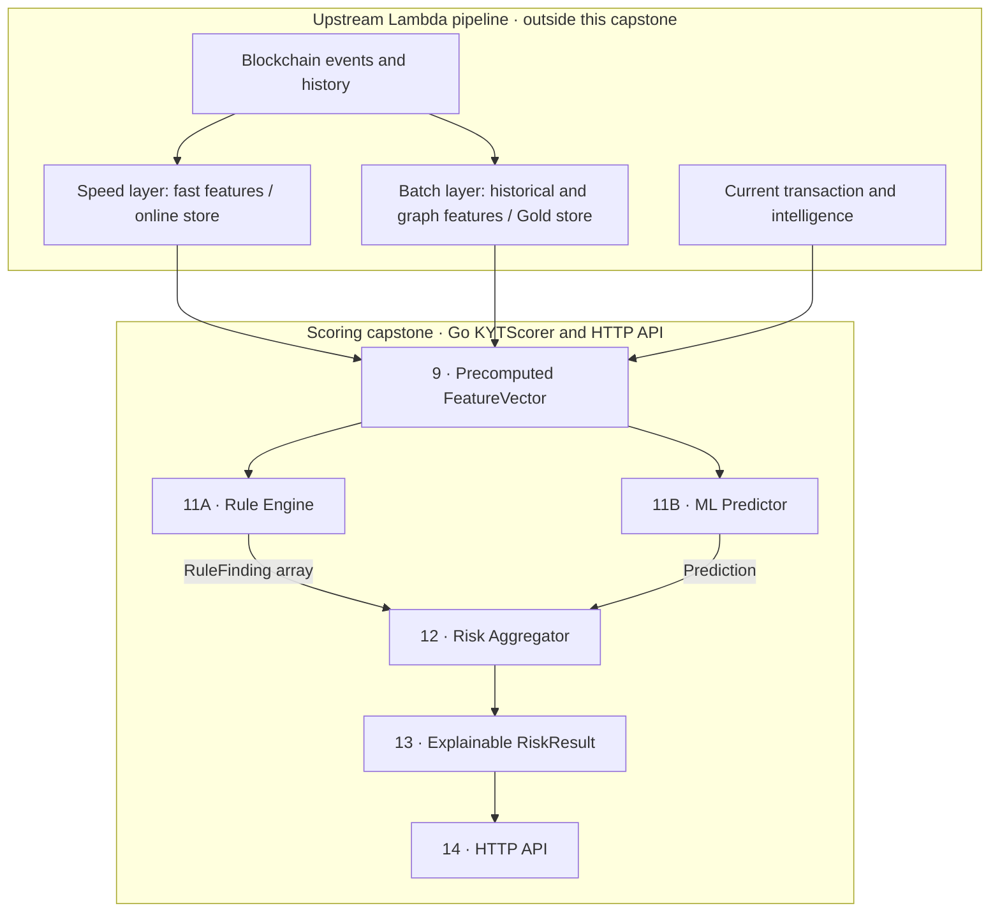
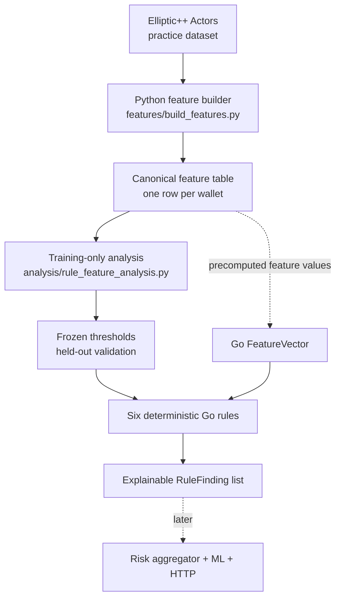

# KYT Engine

**Know Your Transaction (KYT)** assesses transaction risk using activity patterns,
counterparty intelligence, and exposure to illicit activity. This capstone explores
how explicit rules and an ML prediction can produce an explainable risk result.
The application is primarily **Go**. **Python** prepares the Elliptic++ feature
dataset and will later support ML training, evaluation, and model export.

**Current status: Elliptic++ feature extraction, held-out rule analysis, and a Go
rule engine.** The engine evaluates precomputed vectors and returns explainable
findings. Risk aggregation, ML inference, scoring formulas, and HTTP handlers
remain future work. The server entry point and Docker container do not start a service.

## Lambda architecture

Our wider architecture separates a **speed layer** for recent activity from a
**batch layer** for expensive historical and graph analysis. The serving layer
uses recent fast features, the latest batch features, and transaction context to
score a transaction. Batch features can lag behind the speed layer.



An upstream system supplies the **complete `FeatureVector`**. This repository
starts at that input boundary. The separate offline Python pipeline prepares an
educational Elliptic++ dataset for reviewing that input contract.
See the [full numbered blueprint](concepts/assets/KYT-professional.svg) and
[Lambda architecture notes](<concepts/3 - Lambda Architecture and Data pipeline.md>).


## Components 9 onward

We will design components **9–14** from the blueprint within this smaller scope:

| Component | Capstone responsibility |
| --- | --- |
| **9 — Feature vector** | Define the contract for complete, precomputed scoring input. |
| **10 — Offline ML** | Later train, evaluate, and export a small baseline model in Python. |
| **11A — Rule engine** | Evaluate explicit rules and return explainable findings in Go. |
| **11B — ML predictor** | Run inference in Go using a model exported offline. |
| **12 — Risk aggregator** | Combine rule findings and predictions into a risk assessment. |
| **13 — KYT result** | Return an explainable `RiskResult`. |
| **14 — Go service** | Orchestrate scoring through `KYTScorer` and expose it through HTTP. |

Development will use **small synthetic or hand-curated datasets** of precomputed
feature vectors, expected findings, and risk labels. These will support readable
component tests and later ML experiments without requiring a blockchain pipeline.
The Elliptic++ pipeline additionally produces a complete wallet-level feature
table locally. Large source CSVs and derived tables are excluded from Git;
inspection, schema, and validation reports are included. No trained models exist.

For the Go scoring service, ingestion, Kafka, Spark, data lakes, graph construction
and analysis, feature computation and stores, streaming updates, historical rescoring, and Stridge
integration are out of scope. Component 14 is limited to scoring orchestration and
HTTP; persistence, event publishing, notifications, and case workflows are deferred.
See [the capstone boundary](docs/architecture.md).

## Elliptic++ feature dataset

We use Elliptic++ **for practice** to derive and review a wallet-level feature
contract. This offline work is separate from a future production feature pipeline.



The [feature builder](features/build_features.py) preserves the 55 supplied wallet
numeric fields and derives discrete-time and graph features into a local canonical
CSV. Its last column, `label`, is target metadata and is **not** part of a
`FeatureVector`. See the [schema and data setup](data/README.md) and
[feature definitions](docs/elliptic_features.md).

The [analysis script](analysis/rule_feature_analysis.py) excludes unknown target
rows, compares licit and illicit training distributions, and selects readable
thresholds on an 80/20 class-stratified split. It masks validation labels when
rebuilding neighbor intelligence, freezes the chosen thresholds, then measures
precision, recall, false-positive rate, and support on held-out wallets. The
[full analysis](docs/rule_analysis.md) and [frozen thresholds](analysis/results/frozen_rules.json)
explain the evidence and limitations.

The Go rules implement **R1, R2, R4, R5, R6, and R7** from that review. A matching
rule returns its ID, explanation, and observed values versus thresholds; it does
not calculate a risk score. R4 is a stricter R1, and R5 a stricter R2, so matched
findings are not independent evidence. R3 and R8 remain analysis candidates.
See [the Go rule definitions](internal/rules/candidates.go) and
[evaluation path](internal/rules/engine.go).

The Go path begins with an already-populated `FeatureVector`. The CSV is not
automatically loaded into Go, and the placeholder server does not call the engine.
Held-out metrics in the analysis use graph features rebuilt with validation labels
masked. The canonical CSV uses all static public labels, so passing its graph
values directly to Go would **not** reproduce those held-out metrics. A future
upstream feature source must define the intelligence available at decision time.

The threshold boundary examples in [the rule tests](internal/rules/engine_test.go)
set only the three values used by the six current rules. For a complete real
Elliptic++ row, see [the explainability walkthrough](docs/rule_walkthrough.md)
and its [full-row Go test](internal/rules/walkthrough_test.go). Run
`go test ./internal/rules -run TestFullIllicitWalletWalkthrough -v` to see each
matched finding and its observed values.

## Project layout

| Path | Purpose |
| --- | --- |
| `cmd/server/` | Minimal entry point. |
| `internal/domain/` | Feature vector, finding, prediction, and result types. |
| `internal/rules/` | Deterministic rules returning explainable findings. |
| `internal/ml/`, `internal/scoring/` | Future ML inference and aggregation. |
| `internal/api/` | Future HTTP transport. |
| `config/` | Placeholder rule configuration. |
| `ml/`, `models/`, `testdata/` | Future Python work, exported models, and fixtures. |
| `features/`, `analysis/`, `data/`, `tests/` | Offline feature extraction, training-only threshold analysis, data, and Python tests. |
| `docs/`, `concepts/` | Capstone documentation and existing architecture notes. |

## Development

Requires **Go 1.26+**. Make is optional.

```sh
make fmt
make test
make build
make run
```

`make build` writes the executable to `bin/`; `make run` runs the placeholder entry
point. Direct Go checks and execution:

```sh
go fmt ./...
go vet ./...
go test ./...
go build ./...
go run ./cmd/server
```
