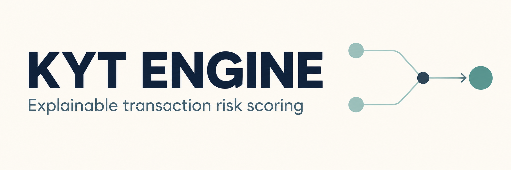
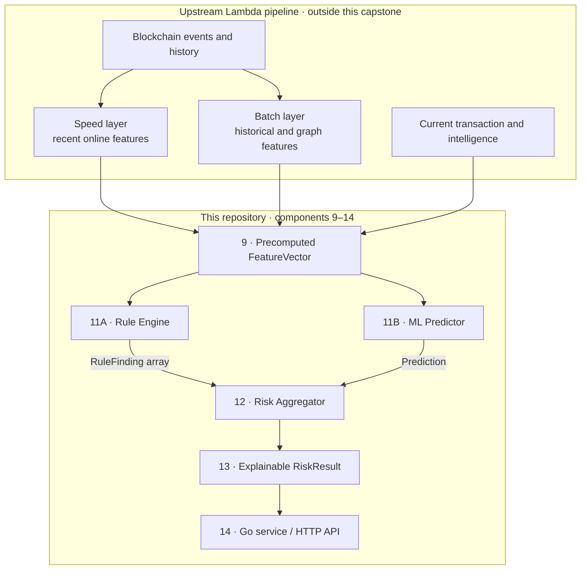
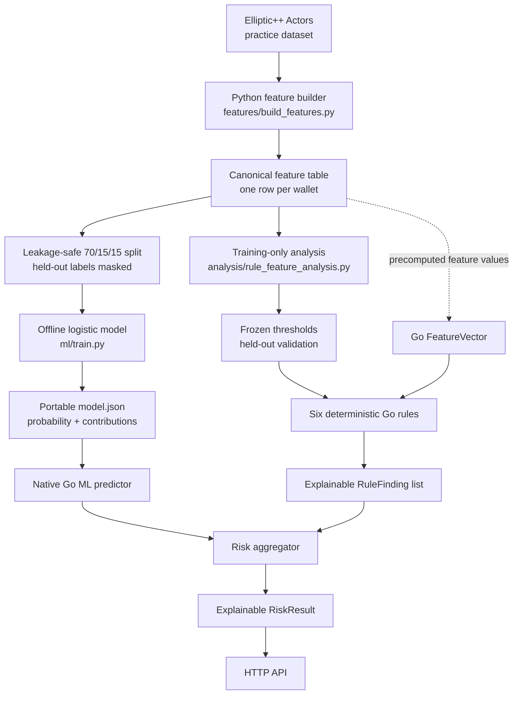

# KYT Engine

## Architecture and core concepts

**Know Your Transaction (KYT)** continuously assesses what funds are doing: where
they came from, where they are going, which counterparties are involved, and
whether the behavior or graph exposure suggests risk. It complements KYC/KYB
identity context; it does not declare an address universally "clean" or "dirty."

A professional result combines several distinct concepts:

| Concept | Meaning in this architecture |
| --- | --- |
| **Attribution and intelligence** | Labels connect addresses or clusters to known entities or risk categories, with source, confidence, and time context. |
| **FeatureVector** | A scoring-ready snapshot of behavioral, temporal, graph, transaction, and intelligence signals computed upstream. |
| **Rule Engine** | Deterministic policy and typology checks that return explicit `RuleFinding` reasons. |
| **ML Predictor** | A statistical model that estimates illicit probability from the same precomputed features. |
| **Risk Aggregator** | Combines rule findings, model output, and policy into the final score or level. |
| **Explainable RiskResult** | Preserves the reasons, observed evidence, prediction, and model/rule context needed for review. |

The full design uses a **Lambda architecture**. Its speed layer updates inexpensive
recent features quickly, while its batch layer computes heavier historical and
graph features. At scoring time, both layers are combined with current transaction
and intelligence context. Heavy features can be slightly stale, and a production
system later corrects material changes through targeted or scheduled rescoring.

This repository deliberately implements the scoring end of that design,
**components 9–14**. Blockchain observation, normalization, Kafka, Spark, the data
lake, graph construction, and production feature computation are upstream systems.
They supply a complete `FeatureVector` to the Go scoring path.



The application is primarily **Go**. **Python** prepares the Elliptic++ practice
dataset and trains, evaluates, explains, and exports the offline ML baseline.

**Current status: the scoped capstone path is complete.** It includes Elliptic++
feature extraction, held-out rule analysis, a Go rule engine, an accepted offline
logistic model, native Go inference, explainable risk aggregation, scoring
orchestration, and an HTTP API. The server loads the model once and can score
complete JSON feature vectors repeatedly.

An upstream system supplies the **complete `FeatureVector`**. This repository
starts at that input boundary. The separate offline Python pipeline prepares an
educational Elliptic++ dataset for reviewing that input contract.
See the [full numbered blueprint](concepts/assets/KYT-professional.svg) and
[Lambda architecture notes](<concepts/3 - Lambda Architecture and Data pipeline.md>).


### Concept notes and diagrams

The `concepts/` directory is the design reference for this project and remains
unchanged. Its files move from domain fundamentals to graph analysis and then to
the complete data architecture:

| File | What it explains |
| --- | --- |
| [`1 - KYT Fundamentals.md`](<concepts/1 - KYT Fundamentals.md>) | Introduces KYC, KYB, and KYT; attribution, direct and indirect exposure, behavioral signals, rules versus ML, risk results, explainability, and human review. |
| [`2 - KYT graphs.md`](<concepts/2 - KYT graphs.md>) | Explains address, transaction, and bipartite graph models; labels, N-hop traversal, flow-aware exposure, graph features, temporal features, and how Elliptic++ supports this capstone. |
| [`3 - Lambda Architecture and Data pipeline.md`](<concepts/3 - Lambda Architecture and Data pipeline.md>) | Describes the Bronze/Silver/Gold data path, Spark and streaming concepts, fast versus heavy features, staleness, cold starts, leakage, rescoring triggers, and the boundary with the Go backend. |
| [`KYT-graph-simplified.png`](concepts/assets/KYT-graph-simplified.png) | A compact end-to-end view from blockchain observation and feature computation through the rule engine, ML predictor, aggregator, result, and Go workflow. |
| [`bronze-silver-gold-boundry.png`](concepts/assets/bronze-silver-gold-boundry.png) | Shows how raw blockchain data becomes normalized history and then scoring-ready behavioral and graph features. |
| [`KYT-triggers.png`](concepts/assets/KYT-triggers.png) | Summarizes the events that can recompute risk: transactions, intelligence or customer-context changes, engine changes, and scheduled monitoring. |
| [`KYT-full-diagram.png`](concepts/assets/KYT-full-diagram.png) | Expands the scoring flow with fast and heavy feature paths, their update timing, staleness, cold-start handling, and retrospective rescoring. |
| [`KYT-professional.png`](concepts/assets/KYT-professional.png) | Raster version of the complete professional Lambda architecture and its numbered component boundaries. |
| [`KYT-professional.svg`](concepts/assets/KYT-professional.svg) | Scalable source used as the main architecture blueprint and embedded above; this capstone begins at component 9. |

## Components 9 onward

This capstone implements components **9–14** from the blueprint within this
smaller scope:

| Component | Capstone responsibility |
| --- | --- |
| **9 — Feature vector** | Define the contract for complete, precomputed scoring input. |
| **10 — Offline ML** | Train, evaluate, explain, and export the accepted logistic baseline in Python. |
| **11A — Rule engine** | Evaluate explicit rules and return explainable findings in Go. |
| **11B — ML predictor** | Run native Go inference with the exported logistic model and explain every prediction. |
| **12 — Risk aggregator** | Combine rule/ML agreement into a policy level while preserving both sources. |
| **13 — KYT result** | Return the complete explainable `RiskResult`. |
| **14 — Go service** | Expose health and repeated JSON scoring over HTTP, with optional one-shot CLI scoring. |

Development uses **small synthetic or hand-curated datasets** of precomputed
feature vectors, expected findings, and risk labels. These support readable
component tests and ML experiments without requiring a blockchain pipeline.
The Elliptic++ pipeline additionally produces a complete wallet-level feature
table locally. Large source CSVs and derived tables are excluded from Git;
inspection, schema, validation, and model-evaluation reports are included. The
portable trained artifact is committed under `models/elliptic-logistic-v1/`.

For the Go scoring service, ingestion, Kafka, Spark, data lakes, graph construction
and analysis, feature computation and stores, streaming updates, historical rescoring, and Stridge
integration are out of scope. Component 14 is limited to scoring orchestration and
HTTP; persistence, event publishing, notifications, and case workflows are deferred.
See [the capstone boundary](docs/architecture.md).

## Elliptic++ feature dataset

We use Elliptic++ **for practice** to derive and review a wallet-level feature
contract. This offline work is separate from a future production feature pipeline.



The [feature builder](features/build_features.py) preserves the 55 supplied wallet
numeric fields and derives discrete-time and graph features into a local canonical
CSV. Its last column, `label`, is target metadata and is **not** part of a
`FeatureVector`. See the [schema and data setup](data/README.md) and
[feature definitions](docs/elliptic_features.md).

The [analysis script](analysis/rule_feature_analysis.py) excludes unknown target
rows, compares licit and illicit training distributions, and selects readable
thresholds on an 80/20 class-stratified split. It masks validation labels when
rebuilding neighbor intelligence, freezes the chosen thresholds, then measures
precision, recall, false-positive rate, and support on held-out wallets. The
[full analysis](docs/rule_analysis.md) and [frozen thresholds](analysis/results/frozen_rules.json)
explain the evidence and limitations.

The Go rules implement **R1, R2, R4, R5, R6, and R7** from that review. A matching
rule returns its ID, explanation, and observed values versus thresholds; it does
not calculate a risk score. R4 is a stricter R1, and R5 a stricter R2, so matched
findings are not independent evidence. R3 and R8 remain analysis candidates.
See [the Go rule definitions](internal/rules/candidates.go) and
[evaluation path](internal/rules/engine.go).

The Go path begins with an already-populated `FeatureVector`. The canonical CSV is
not automatically loaded into Go; `cmd/server` accepts complete JSON vectors over
HTTP or one JSON vector in explicit CLI mode and runs the rule engine, predictor,
and aggregator.
Held-out metrics in the analysis use graph features rebuilt with validation labels
masked. The canonical CSV uses all static public labels, so passing its graph
values directly to Go would **not** reproduce those held-out metrics. A future
upstream feature source must define the intelligence available at decision time.

The threshold boundary examples in [the rule tests](internal/rules/engine_test.go)
set only the three values used by the six current rules. For a complete real
Elliptic++ row, see [the explainability walkthrough](docs/rule_walkthrough.md)
and its [full-row Go test](internal/rules/walkthrough_test.go). Run
`go test ./internal/rules -run TestFullIllicitWalletWalkthrough -v` to see each
matched finding and its observed values.

## Offline ML baseline

The [training pipeline](ml/train.py) uses only licit and illicit targets. Unknown
wallets remain topology nodes. It creates a deterministic 70/15/15 wallet split
and rebuilds graph-intelligence features using **training labels only**, with
validation and test labels masked before feature construction. Absolute time/block
identifiers, duplicate derived fields, wallet ID, and target label are excluded.

The selected 65-feature L2 logistic model passes the predeclared capstone gate on
the Elliptic++ development holdout:

| PR-AUC | Precision | Recall | False-positive rate | Accuracy |
| ---: | ---: | ---: | ---: | ---: |
| **0.9700** | **97.79%** | **89.11%** | **0.11%** | **99.31%** |

PR-AUC is the primary metric because illicit wallets are only 5.38% of supervised
rows. See the [complete ML report](docs/ml_analysis.md),
[metrics](models/elliptic-logistic-v1/metrics.json), and portable
[model artifact](models/elliptic-logistic-v1/model.json).

The report discloses that an initial recall-maximizing threshold narrowly failed
the FPR gate and the same holdout was observed before correction to the planned
F0.5 policy. The result is suitable for this educational capstone; an external or
time-separated dataset is still required for an unbiased deployment estimate.
See the [exact prediction walkthrough](docs/ml_prediction_walkthrough.md) for one
illicit test wallet's raw inputs, feature contributions, probability, and threshold.
The [native Go predictor](docs/ml_predictor.md) loads the exported JSON model and
reproduces that example to floating-point tolerance without Python.

For this capstone, we **reimplemented the trained logistic model's inference in
Go**: Python exports the ordered features, preprocessing parameters, coefficients,
intercept, and threshold, and Go applies the same transformations and equation.
Python still owns training; Go only serves the frozen artifact. This keeps a small
CPU model local, fast, and easy to explain, with parity tests protecting against
training-serving differences.

Production systems can choose a different serving boundary. A larger or
Python-dependent model may run behind a separately deployed HTTP/gRPC model API,
or use a standard serving/runtime format such as ONNX, TensorFlow Serving, or
Triton. That choice adds independent model deployment and scaling, but also a
network hop and another service to operate. Native Go inference is appropriate for
this deliberately small logistic baseline; it is not a requirement of the wider
KYT architecture.

## Risk aggregation

I would implement the aggregator as an **explainable policy layer**, without adding arbitrary rule weights such as `+20`.

```text
FeatureVector
   ├── Rule Engine → RuleFinding[]
   └── ML Predictor → Prediction
                            │
                            v
                     Risk Aggregator
                            │
                            v
                       RiskResult
```

### Proposed v1 algorithm

1. **Validate inputs**

   - Prediction and findings must belong to the same wallet.
   - Probability must be within `[0,1]`.
   - Reject duplicate or unknown rule IDs.

2. **Remove overlapping rule signals**

   Some rules describe the same evidence:

   ```text
   R4 supersedes R1
   R5 supersedes R2
   ```

   We retain every finding for audit, but only the strongest rule from each family becomes a primary reason. This avoids counting the same exposure twice.

3. **Calculate two clear signals**

   ```go
   mlTriggered   := probability >= modelThreshold
   rulesTriggered := len(primaryFindings) > 0
   ```

4. **Combine them using an agreement matrix**

   | Rules | ML | Result |
   | --- | --- | --- |
   | No match | Licit | Low |
   | Match | Licit | Medium / review |
   | No match | Illicit | Medium / review |
   | Match | Illicit | High / review |

   Rules and ML use related features, so we will **not** pretend they are independent probabilities.

5. **Keep the ML probability unchanged**

   If ML returns `0.82`, the result preserves `82%`. We should not calculate something misleading like:

   ```text
   82% + R1 + R6 = 97%
   ```

   A future calibrated aggregate score would require separate validation data.

6. **Return complete explanations**

   ```json
   {
     "wallet_id": "wallet-A",
     "level": "high",
     "review_recommended": true,
     "ml_probability": 0.82,
     "ml_triggered": true,
     "matched_rules": ["R1", "R4", "R6"],
     "primary_rules": ["R4", "R6"],
     "reasons": [
       "ML probability 82% exceeded its 69.34% threshold",
       "At least 60% of distinct neighbors are labelled illicit",
       "Direct and two-hop illicit exposure were both observed"
     ]
   }
   ```

### Files

- [`risk_result.go`](internal/domain/risk_result.go): defines `RiskResult`, risk level, decision, reasons, findings, and prediction.
- [`aggregator.go`](internal/scoring/aggregator.go): validates inputs, collapses overlapping findings, applies the agreement matrix, and constructs the result.
- [`scorer.go`](internal/scoring/scorer.go): orchestrates `RuleEngine → Predictor → Aggregator`.
- [`aggregator_test.go`](internal/scoring/aggregator_test.go): tests all four rule/ML combinations and overlapping rules.
- [`scorer_test.go`](internal/scoring/scorer_test.go): tests the complete feature-vector-to-result route.

The main design choice is to keep three values distinct:

```text
ML probability      = statistical model output
Rule findings       = deterministic evidence
Risk level/decision = business policy produced by the aggregator
```

That gives us a useful aggregator now without presenting an uncalibrated blended number as a probability.

## Complete engine validation

The [complete evaluation](docs/engine_evaluation.md) rebuilds graph intelligence
with training labels only, then evaluates the frozen 39,803-wallet test partition.
Every complete vector was also posted to the running Go HTTP container and compared
with the independent offline calculation.

| Positive output | Precision | Recall | False-positive rate | Flagged |
| --- | ---: | ---: | ---: | ---: |
| ML threshold | 97.79% | 89.11% | 0.11% | 1,950 |
| Any active rule | 89.86% | 89.81% | 0.58% | 2,139 |
| Final review: rules OR ML | **89.26%** | **92.01%** | **0.63%** | 2,206 |
| High: rules AND ML | 98.78% | 86.92% | 0.06% | 1,883 |

All **39,803** HTTP responses matched the expected probability, class, rule IDs,
primary findings, level, and action, with zero parity failures. The final review
policy passes the educational gate of precision ≥80%, recall ≥70%, FPR ≤1%, and
ML PR-AUC ≥0.80. It gains 62 true positives over ML alone at the cost of 194
additional licit reviews. Reproduce it while the local API is running:

```bash
python -m analysis.evaluate_engine --workers 8
```

This is sufficient for the capstone, not a production-readiness claim. Elliptic++
uses static historical labels, the split is random and transductive rather than
time- or entity-separated, and the review policy has not been calibrated to a real
institution's cases, alert capacity, or costs.

## Worked explainability examples

| Path | Real Elliptic++ example | Exact result |
| --- | --- | --- |
| [Complete rule walkthrough](docs/rule_walkthrough.md) | Wallet `114H4VXXRicqSRhgjDorRidu6NJXsqBfan`: direct illicit ratio `0.50`, two-hop illicit count `147`, total transactions `2` | Findings `R1`, `R2`, `R5`, `R6`, and `R7`; `R4` does not match. The dataset target is separate from the rule output. |
| [Complete ML walkthrough](docs/ml_prediction_walkthrough.md) | Wallet `15DaavwDvdatJa1dqHRbhAjeJ9nk8bPVqL`: one of two direct neighbors illicit, four illicit wallets at two hops, two total transactions | `-8.7721 + 12.6629 = 3.8907` log-odds; sigmoid = **97.9979%**, above the **69.3382%** threshold, so the model predicts `illicit`. |

ML feature contributions such as `+2.9962` are additive **log-odds**, not
percentage points. Each equals `standardized feature value × learned coefficient`.
The model sums all 65 contributions with the intercept, then applies the sigmoid
function once to convert the final log-odds into a probability.

## Project layout

| Path | Purpose |
| --- | --- |
| `cmd/server/` | HTTP server startup, graceful shutdown, and optional one-shot scoring. |
| `internal/domain/` | Feature vector, finding, prediction, and result types. |
| `internal/rules/` | Deterministic rules returning explainable findings. |
| `internal/ml/`, `internal/scoring/` | Native Go ML inference, orchestration, and explainable aggregation. |
| `internal/api/` | JSON contract validation, health endpoint, and scoring endpoint. |
| `config/` | Placeholder rule configuration. |
| `ml/`, `models/`, `testdata/` | Offline ML pipeline, exported model, and fixtures. |
| `features/`, `analysis/`, `data/`, `tests/` | Offline feature extraction, training-only threshold analysis, data, and Python tests. |
| `docs/`, `concepts/` | Capstone documentation and existing architecture notes. |

## Development

Requires **Go 1.26+**. Make is optional.

```sh
make fmt
make test
make build
make run
```

`make build` writes the executable to `bin/`; `make run` starts the HTTP server on
port 8080. `make score` runs the licit-agreement fixture once; select another with
`make score INPUT=testdata/risk_examples/disagreement.json`. `make score-all`
scores every top-level `.json` vector in `testdata/risk_examples`, loading the
model once and returning one ordered JSON batch. Select another directory with
`make score-all TESTDATA=path/to/vectors`. Direct Go checks and execution:

```sh
go fmt ./...
go vet ./...
go test ./...
go build ./...
go run ./cmd/server
go run ./cmd/server -input testdata/risk_examples/licit-agreement.json
go run ./cmd/server -input-dir testdata/risk_examples
```

Use `-input -` to score one JSON vector through standard input. A target `label` is
intentionally rejected because it is not part of a runtime `FeatureVector`.
`-input` and `-input-dir` are mutually exclusive. Batch mode processes only
top-level `.json` files in deterministic filename order and stops on an invalid
vector rather than returning a partial batch.

## HTTP API and long-running container

The service exposes:

| Method | Path | Purpose |
| --- | --- | --- |
| `GET` | `/healthz` | Confirm that startup and model loading succeeded. |
| `POST` | `/v1/score` | Score one complete JSON `FeatureVector`. |

Docker is installed machine-wide rather than inside this repository. On Windows
with WSL, start Docker Desktop and ensure its WSL integration is enabled. Confirm
that Docker and `curl` are available from the Bash terminal:

```bash
docker --version
docker info
curl --version
```

`jq` is optional but makes JSON output readable. In WSL Ubuntu/Debian, install it
with:

```bash
sudo apt update
sudo apt install -y jq
```

### Bash / WSL

Build the image, remove an older container with the same name if necessary, and
create one retained background container:

```bash
docker build -t kyt-engine:capstone .
docker rm -f kyt-engine 2>/dev/null || true
docker run -d \
  --name kyt-engine \
  --restart unless-stopped \
  -p 8080:8080 \
  kyt-engine:capstone
```

Check the running container and server health:

```bash
docker ps
curl -sS http://localhost:8080/healthz | jq
```

The process and model remain loaded in this container. Score any number of vectors
against the same process:

```bash
curl -sS \
  -X POST \
  -H 'Content-Type: application/json' \
  --data-binary @testdata/risk_examples/disagreement.json \
  http://localhost:8080/v1/score | jq
```

Use `python` when `jq` is unavailable:

```bash
curl -sS \
  -X POST \
  -H 'Content-Type: application/json' \
  --data-binary @testdata/risk_examples/disagreement.json \
  http://localhost:8080/v1/score | python -m json.tool
```

The response can also be printed without a formatter by removing `| jq`. If Bash
reports `jq: command not found`, the closed pipe may also make curl report
`curl: (23) Failure writing output to destination`; this does not indicate a
scoring-service failure.

Repeat the scoring command with `licit-agreement.json` or
`illicit-agreement.json`. Docker does not create a container per request. Inspect
and manage the retained container with:

```bash
docker logs -f kyt-engine
docker stop kyt-engine
docker start kyt-engine
docker rm -f kyt-engine
```

For a disposable one-shot container:

```bash
cat testdata/risk_examples/disagreement.json |
  docker run --rm -i kyt-engine:capstone -input -
```

To score every test vector in one disposable container, mount the input directory
read-only and use batch mode:

```bash
docker run --rm \
  -v "$PWD/testdata/risk_examples:/inputs:ro" \
  kyt-engine:capstone -input-dir /inputs
```

This command starts one container, loads the model once, scores all three example
files, prints the combined result, and removes the container. The retained HTTP
container remains the right option for repeatedly scoring vectors over `/v1/score`.

### PowerShell

The equivalent build and retained-container commands are:

```powershell
docker build -t kyt-engine:capstone .
docker rm -f kyt-engine 2>$null
docker run -d --name kyt-engine --restart unless-stopped -p 8080:8080 kyt-engine:capstone
docker ps
Invoke-RestMethod http://localhost:8080/healthz
```

The process and model remain in that container. Send as many vectors as needed to
the same endpoint:

```powershell
$result = Invoke-RestMethod `
  -Method Post `
  -Uri http://localhost:8080/v1/score `
  -ContentType "application/json" `
  -InFile testdata\risk_examples\licit-agreement.json

$result | ConvertTo-Json -Depth 20
```

Inspect and manage the retained container with:

```powershell
docker logs -f kyt-engine
docker stop kyt-engine
docker start kyt-engine
docker rm -f kyt-engine
```

For a disposable one-shot container instead:

```powershell
Get-Content -Raw testdata\risk_examples\disagreement.json |
  docker run --rm -i kyt-engine:capstone -input -
```

## End-to-end risk examples

These are complete Elliptic++ rows with the dataset target retained only as
external metadata. “Rules say licit” below means no deterministic rule matched;
the rule engine itself does not predict a class. Each linked result contains the
full prediction factors, findings, evidence, primary findings, and reasons emitted
by the command.

### Licit agreement

Dataset target: `licit`. Input: [`licit-agreement.json`](testdata/risk_examples/licit-agreement.json).
Full output: [`licit-agreement-result.json`](testdata/risk_examples/results/licit-agreement-result.json).

```json
{
  "wallet_id": "111112TykSw72ztDN2WJger4cynzWYC5w",
  "level": "low",
  "recommended_action": "no_review",
  "review_recommended": false,
  "ml_probability": 1.0039666876116033e-7,
  "ml_threshold": 0.693382385987544,
  "ml_class": "licit",
  "matched_rules": [],
  "primary_rules": [],
  "reasons": [
    "ML probability 0.0000% was below the 69.3382% decision threshold.",
    "No deterministic rules matched.",
    "Rules and ML agree that this wallet is not flagged."
  ]
}
```

### Rule/ML disagreement

Dataset target: `licit`. Input: [`disagreement.json`](testdata/risk_examples/disagreement.json).
Full output: [`disagreement-result.json`](testdata/risk_examples/results/disagreement-result.json).

```json
{
  "wallet_id": "1133XY4Ctn7KwHhwBqbLr3rBugfHff4Uaq",
  "level": "medium",
  "recommended_action": "review",
  "review_recommended": true,
  "ml_probability": 0.2981368070288999,
  "ml_threshold": 0.693382385987544,
  "ml_class": "licit",
  "matched_rules": ["R2"],
  "primary_rules": ["R2"],
  "reasons": [
    "ML probability 29.8137% was below the 69.3382% decision threshold.",
    "Rule R2: At least 50 distinct illicit wallets are exactly two undirected graph hops away.",
    "Rules and ML disagree; review is recommended."
  ]
}
```

R2 matched because the row has `53` distinct illicit wallets exactly two hops
away. The model still predicted licit, so the aggregator preserves the disagreement
and recommends review instead of manufacturing a new probability.

### Illicit agreement

Dataset target: `illicit`. Input: [`illicit-agreement.json`](testdata/risk_examples/illicit-agreement.json).
Full output: [`illicit-agreement-result.json`](testdata/risk_examples/results/illicit-agreement-result.json).

```json
{
  "wallet_id": "111iu559diy1cBDTP9cRhy8sYYcECvvrw",
  "level": "high",
  "recommended_action": "review",
  "review_recommended": true,
  "ml_probability": 0.9998177989609814,
  "ml_threshold": 0.693382385987544,
  "ml_class": "illicit",
  "matched_rules": ["R1", "R2", "R5", "R6", "R7"],
  "primary_rules": ["R1", "R5", "R6", "R7"],
  "reasons": [
    "ML probability 99.9818% met or exceeded the 69.3382% decision threshold.",
    "Rule R1: At least 20% of distinct graph neighbors are labeled illicit.",
    "Rule R5: At least 100 distinct illicit wallets are exactly two hops away; stricter than R2.",
    "Rule R6: At least 10% illicit neighbors and at least two distinct illicit wallets exactly two hops away.",
    "Rule R7: At least 10% illicit neighbors and at least two total transactions in the provided wallet features.",
    "Rules and ML both flag risk; review is recommended."
  ]
}
```

All five matches remain in `matched_findings`. R5 supersedes the nested R2 in
`primary_findings`, which prevents the same two-hop evidence from being presented
twice as a primary reason.
