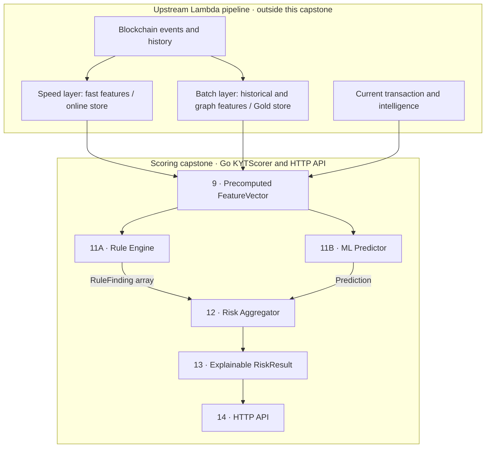

# KYT Engine

**Know Your Transaction (KYT)** assesses transaction risk using activity patterns,
counterparty intelligence, and exposure to illicit activity. This capstone explores
how explicit rules and an ML prediction can produce an explainable risk result.
The application is primarily **Go**. **Python** prepares the Elliptic++ feature
dataset and will later support ML training, evaluation, and model export.

**Current status: Go scaffold plus Elliptic++ feature extraction.** Go types are
empty placeholders. Rules, scoring formulas, models, and HTTP handlers will be
designed and reviewed one component at
a time. The entry point and Docker container currently exit without starting a service.

## Lambda architecture

Our wider architecture separates a **speed layer** for recent activity from a
**batch layer** for expensive historical and graph analysis. The serving layer
uses recent fast features, the latest batch features, and transaction context to
score a transaction. Batch features can lag behind the speed layer.



An upstream system supplies the **complete `FeatureVector`**. This repository
starts at that input boundary. The separate offline Python pipeline prepares an
educational Elliptic++ dataset for reviewing that input contract.
See the [full numbered blueprint](concepts/assets/KYT-professional.svg) and
[Lambda architecture notes](<concepts/3 - Lambda Architecture and Data pipeline.md>).


## Components 9 onward

We will design components **9–14** from the blueprint within this smaller scope:

| Component | Capstone responsibility |
| --- | --- |
| **9 — Feature vector** | Define the contract for complete, precomputed scoring input. |
| **10 — Offline ML** | Later train, evaluate, and export a small baseline model in Python. |
| **11A — Rule engine** | Evaluate explicit rules and return explainable findings in Go. |
| **11B — ML predictor** | Run inference in Go using a model exported offline. |
| **12 — Risk aggregator** | Combine rule findings and predictions into a risk assessment. |
| **13 — KYT result** | Return an explainable `RiskResult`. |
| **14 — Go service** | Orchestrate scoring through `KYTScorer` and expose it through HTTP. |

Development will use **small synthetic or hand-curated datasets** of precomputed
feature vectors, expected findings, and risk labels. These will support readable
component tests and later ML experiments without requiring a blockchain pipeline.
The Elliptic++ pipeline additionally produces a complete wallet-level feature
table locally. Large source CSVs and derived tables are excluded from Git;
inspection, schema, and validation reports are included. No trained models exist.

For the Go scoring service, ingestion, Kafka, Spark, data lakes, graph construction
and analysis, feature computation and stores, streaming updates, historical rescoring, and Stridge
integration are out of scope. Component 14 is limited to scoring orchestration and
HTTP; persistence, event publishing, notifications, and case workflows are deferred.
See [the capstone boundary](docs/architecture.md).

## Elliptic++ feature dataset

This offline step inspects the official Actors data, preserves its numeric fields,
and derives topology, discrete-time summaries, and coarse neighbor-label
intelligence. It outputs one row per wallet, with `label` last as target metadata.
Target labels never contribute to their own features. Static neighbor labels
simulate an intelligence layer and require care in future ML evaluation.

See [setup and commands](data/README.md), [the inspected schema](docs/elliptic_schema.md),
and [feature definitions and limitations](docs/elliptic_features.md).

## Project layout

| Path | Purpose |
| --- | --- |
| `cmd/server/` | Minimal entry point. |
| `internal/domain/` | Feature vector, finding, prediction, and result types. |
| `internal/rules/`, `internal/ml/`, `internal/scoring/` | Go scoring components. |
| `internal/api/` | Future HTTP transport. |
| `config/` | Placeholder rule configuration. |
| `ml/`, `models/`, `testdata/` | Future Python work, exported models, and fixtures. |
| `features/`, `data/`, `tests/` | Offline Elliptic++ extraction, local data, and Python tests. |
| `docs/`, `concepts/` | Capstone documentation and existing architecture notes. |

## Development

Requires **Go 1.26+**. Make is optional.

```sh
make fmt
make test
make build
make run
```

`make build` writes the executable to `bin/`; `make run` runs the placeholder entry
point. Direct Go checks and execution:

```sh
go fmt ./...
go vet ./...
go test ./...
go build ./...
go run ./cmd/server
```
