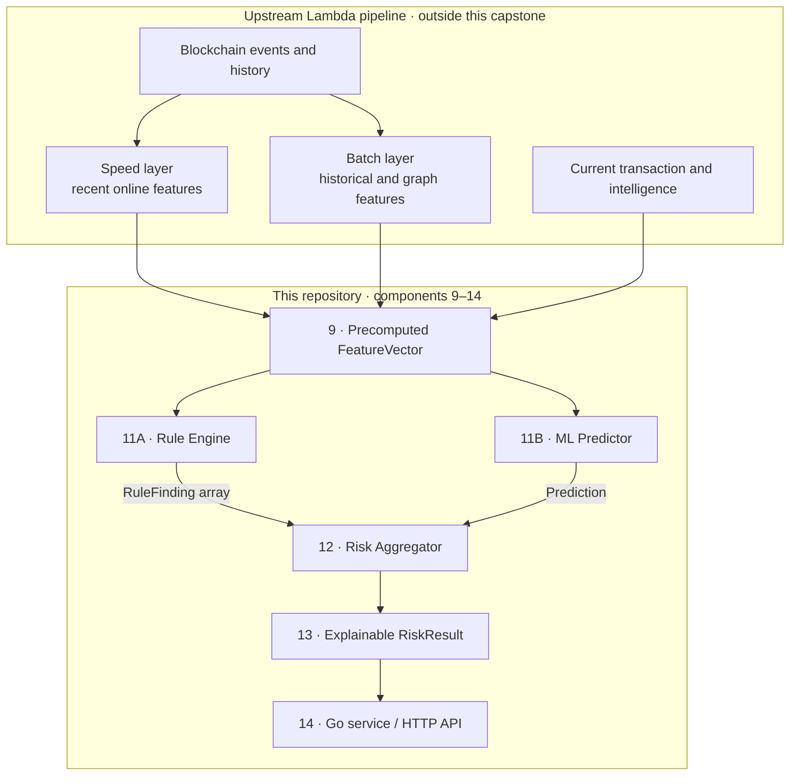
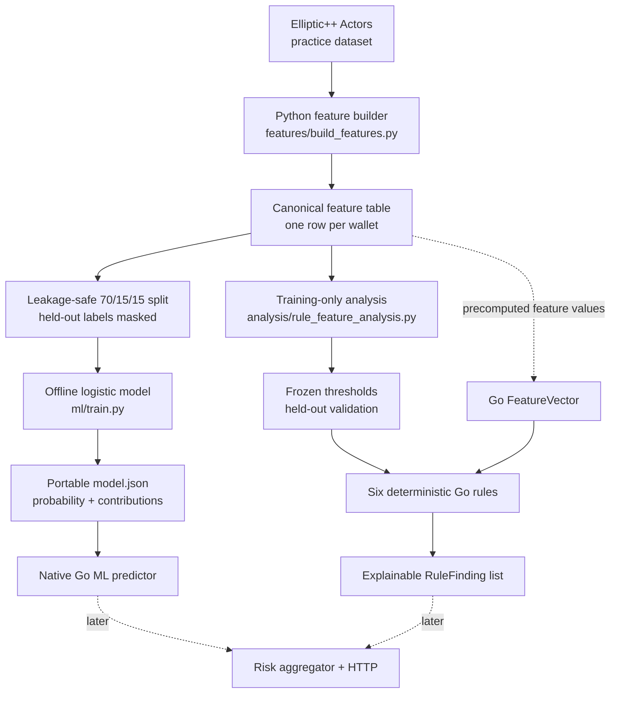

# KYT Engine

## Architecture and core concepts

**Know Your Transaction (KYT)** continuously assesses what funds are doing: where
they came from, where they are going, which counterparties are involved, and
whether the behavior or graph exposure suggests risk. It complements KYC/KYB
identity context; it does not declare an address universally "clean" or "dirty."

A professional result combines several distinct concepts:

| Concept | Meaning in this architecture |
| --- | --- |
| **Attribution and intelligence** | Labels connect addresses or clusters to known entities or risk categories, with source, confidence, and time context. |
| **FeatureVector** | A scoring-ready snapshot of behavioral, temporal, graph, transaction, and intelligence signals computed upstream. |
| **Rule Engine** | Deterministic policy and typology checks that return explicit `RuleFinding` reasons. |
| **ML Predictor** | A statistical model that estimates illicit probability from the same precomputed features. |
| **Risk Aggregator** | Combines rule findings, model output, and policy into the final score or level. |
| **Explainable RiskResult** | Preserves the reasons, observed evidence, prediction, and model/rule context needed for review. |

The full design uses a **Lambda architecture**. Its speed layer updates inexpensive
recent features quickly, while its batch layer computes heavier historical and
graph features. At scoring time, both layers are combined with current transaction
and intelligence context. Heavy features can be slightly stale, and a production
system later corrects material changes through targeted or scheduled rescoring.

This repository deliberately implements the scoring end of that design,
**components 9–14**. Blockchain observation, normalization, Kafka, Spark, the data
lake, graph construction, and production feature computation are upstream systems.
They supply a complete `FeatureVector` to the Go scoring path.



The application is primarily **Go**. **Python** prepares the Elliptic++ practice
dataset and trains, evaluates, explains, and exports the offline ML baseline.

**Current status: Elliptic++ feature extraction, held-out rule analysis, a Go rule
engine, an accepted offline logistic-regression model, and native Go ML inference.**
The rule engine returns explainable findings, Python exports a portable probability
model, and Go reproduces its probability and contributions. Risk aggregation,
scoring formulas, and HTTP handlers remain future work.
The server entry point and Docker container do not start a service.

An upstream system supplies the **complete `FeatureVector`**. This repository
starts at that input boundary. The separate offline Python pipeline prepares an
educational Elliptic++ dataset for reviewing that input contract.
See the [full numbered blueprint](concepts/assets/KYT-professional.svg) and
[Lambda architecture notes](<concepts/3 - Lambda Architecture and Data pipeline.md>).


### Concept notes and diagrams

The `concepts/` directory is the design reference for this project and remains
unchanged. Its files move from domain fundamentals to graph analysis and then to
the complete data architecture:

| File | What it explains |
| --- | --- |
| [`1 - KYT Fundamentals.md`](<concepts/1 - KYT Fundamentals.md>) | Introduces KYC, KYB, and KYT; attribution, direct and indirect exposure, behavioral signals, rules versus ML, risk results, explainability, and human review. |
| [`2 - KYT graphs.md`](<concepts/2 - KYT graphs.md>) | Explains address, transaction, and bipartite graph models; labels, N-hop traversal, flow-aware exposure, graph features, temporal features, and how Elliptic++ supports this capstone. |
| [`3 - Lambda Architecture and Data pipeline.md`](<concepts/3 - Lambda Architecture and Data pipeline.md>) | Describes the Bronze/Silver/Gold data path, Spark and streaming concepts, fast versus heavy features, staleness, cold starts, leakage, rescoring triggers, and the boundary with the Go backend. |
| [`KYT-graph-simplified.png`](concepts/assets/KYT-graph-simplified.png) | A compact end-to-end view from blockchain observation and feature computation through the rule engine, ML predictor, aggregator, result, and Go workflow. |
| [`bronze-silver-gold-boundry.png`](concepts/assets/bronze-silver-gold-boundry.png) | Shows how raw blockchain data becomes normalized history and then scoring-ready behavioral and graph features. |
| [`KYT-triggers.png`](concepts/assets/KYT-triggers.png) | Summarizes the events that can recompute risk: transactions, intelligence or customer-context changes, engine changes, and scheduled monitoring. |
| [`KYT-full-diagram.png`](concepts/assets/KYT-full-diagram.png) | Expands the scoring flow with fast and heavy feature paths, their update timing, staleness, cold-start handling, and retrospective rescoring. |
| [`KYT-professional.png`](concepts/assets/KYT-professional.png) | Raster version of the complete professional Lambda architecture and its numbered component boundaries. |
| [`KYT-professional.svg`](concepts/assets/KYT-professional.svg) | Scalable source used as the main architecture blueprint and embedded above; this capstone begins at component 9. |

## Components 9 onward

We will design components **9–14** from the blueprint within this smaller scope:

| Component | Capstone responsibility |
| --- | --- |
| **9 — Feature vector** | Define the contract for complete, precomputed scoring input. |
| **10 — Offline ML** | Train, evaluate, explain, and export the accepted logistic baseline in Python. |
| **11A — Rule engine** | Evaluate explicit rules and return explainable findings in Go. |
| **11B — ML predictor** | Run native Go inference with the exported logistic model and explain every prediction. |
| **12 — Risk aggregator** | Combine rule findings and predictions into a risk assessment. |
| **13 — KYT result** | Return an explainable `RiskResult`. |
| **14 — Go service** | Orchestrate scoring through `KYTScorer` and expose it through HTTP. |

Development uses **small synthetic or hand-curated datasets** of precomputed
feature vectors, expected findings, and risk labels. These support readable
component tests and ML experiments without requiring a blockchain pipeline.
The Elliptic++ pipeline additionally produces a complete wallet-level feature
table locally. Large source CSVs and derived tables are excluded from Git;
inspection, schema, validation, and model-evaluation reports are included. The
portable trained artifact is committed under `models/elliptic-logistic-v1/`.

For the Go scoring service, ingestion, Kafka, Spark, data lakes, graph construction
and analysis, feature computation and stores, streaming updates, historical rescoring, and Stridge
integration are out of scope. Component 14 is limited to scoring orchestration and
HTTP; persistence, event publishing, notifications, and case workflows are deferred.
See [the capstone boundary](docs/architecture.md).

## Elliptic++ feature dataset

We use Elliptic++ **for practice** to derive and review a wallet-level feature
contract. This offline work is separate from a future production feature pipeline.



The [feature builder](features/build_features.py) preserves the 55 supplied wallet
numeric fields and derives discrete-time and graph features into a local canonical
CSV. Its last column, `label`, is target metadata and is **not** part of a
`FeatureVector`. See the [schema and data setup](data/README.md) and
[feature definitions](docs/elliptic_features.md).

The [analysis script](analysis/rule_feature_analysis.py) excludes unknown target
rows, compares licit and illicit training distributions, and selects readable
thresholds on an 80/20 class-stratified split. It masks validation labels when
rebuilding neighbor intelligence, freezes the chosen thresholds, then measures
precision, recall, false-positive rate, and support on held-out wallets. The
[full analysis](docs/rule_analysis.md) and [frozen thresholds](analysis/results/frozen_rules.json)
explain the evidence and limitations.

The Go rules implement **R1, R2, R4, R5, R6, and R7** from that review. A matching
rule returns its ID, explanation, and observed values versus thresholds; it does
not calculate a risk score. R4 is a stricter R1, and R5 a stricter R2, so matched
findings are not independent evidence. R3 and R8 remain analysis candidates.
See [the Go rule definitions](internal/rules/candidates.go) and
[evaluation path](internal/rules/engine.go).

The Go path begins with an already-populated `FeatureVector`. The CSV is not
automatically loaded into Go, and the placeholder server does not call the engine.
Held-out metrics in the analysis use graph features rebuilt with validation labels
masked. The canonical CSV uses all static public labels, so passing its graph
values directly to Go would **not** reproduce those held-out metrics. A future
upstream feature source must define the intelligence available at decision time.

The threshold boundary examples in [the rule tests](internal/rules/engine_test.go)
set only the three values used by the six current rules. For a complete real
Elliptic++ row, see [the explainability walkthrough](docs/rule_walkthrough.md)
and its [full-row Go test](internal/rules/walkthrough_test.go). Run
`go test ./internal/rules -run TestFullIllicitWalletWalkthrough -v` to see each
matched finding and its observed values.

## Offline ML baseline

The [training pipeline](ml/train.py) uses only licit and illicit targets. Unknown
wallets remain topology nodes. It creates a deterministic 70/15/15 wallet split
and rebuilds graph-intelligence features using **training labels only**, with
validation and test labels masked before feature construction. Absolute time/block
identifiers, duplicate derived fields, wallet ID, and target label are excluded.

The selected 65-feature L2 logistic model passes the predeclared capstone gate on
the Elliptic++ development holdout:

| PR-AUC | Precision | Recall | False-positive rate | Accuracy |
| ---: | ---: | ---: | ---: | ---: |
| **0.9700** | **97.79%** | **89.11%** | **0.11%** | **99.31%** |

PR-AUC is the primary metric because illicit wallets are only 5.38% of supervised
rows. See the [complete ML report](docs/ml_analysis.md),
[metrics](models/elliptic-logistic-v1/metrics.json), and portable
[model artifact](models/elliptic-logistic-v1/model.json).

The report discloses that an initial recall-maximizing threshold narrowly failed
the FPR gate and the same holdout was observed before correction to the planned
F0.5 policy. The result is suitable for this educational capstone; an external or
time-separated dataset is still required for an unbiased deployment estimate.
See the [exact prediction walkthrough](docs/ml_prediction_walkthrough.md) for one
illicit test wallet's raw inputs, feature contributions, probability, and threshold.
The [native Go predictor](docs/ml_predictor.md) loads the exported JSON model and
reproduces that example to floating-point tolerance without Python.

For this capstone, we **reimplemented the trained logistic model's inference in
Go**: Python exports the ordered features, preprocessing parameters, coefficients,
intercept, and threshold, and Go applies the same transformations and equation.
Python still owns training; Go only serves the frozen artifact. This keeps a small
CPU model local, fast, and easy to explain, with parity tests protecting against
training-serving differences.

Production systems can choose a different serving boundary. A larger or
Python-dependent model may run behind a separately deployed HTTP/gRPC model API,
or use a standard serving/runtime format such as ONNX, TensorFlow Serving, or
Triton. That choice adds independent model deployment and scaling, but also a
network hop and another service to operate. Native Go inference is appropriate for
this deliberately small logistic baseline; it is not a requirement of the wider
KYT architecture.

## Worked explainability examples

| Path | Real Elliptic++ example | Exact result |
| --- | --- | --- |
| [Complete rule walkthrough](docs/rule_walkthrough.md) | Wallet `114H4VXXRicqSRhgjDorRidu6NJXsqBfan`: direct illicit ratio `0.50`, two-hop illicit count `147`, total transactions `2` | Findings `R1`, `R2`, `R5`, `R6`, and `R7`; `R4` does not match. The dataset target is separate from the rule output. |
| [Complete ML walkthrough](docs/ml_prediction_walkthrough.md) | Wallet `15DaavwDvdatJa1dqHRbhAjeJ9nk8bPVqL`: one of two direct neighbors illicit, four illicit wallets at two hops, two total transactions | `-8.7721 + 12.6629 = 3.8907` log-odds; sigmoid = **97.9979%**, above the **69.3382%** threshold, so the model predicts `illicit`. |

ML feature contributions such as `+2.9962` are additive **log-odds**, not
percentage points. Each equals `standardized feature value × learned coefficient`.
The model sums all 65 contributions with the intercept, then applies the sigmoid
function once to convert the final log-odds into a probability.

## Project layout

| Path | Purpose |
| --- | --- |
| `cmd/server/` | Minimal entry point. |
| `internal/domain/` | Feature vector, finding, prediction, and result types. |
| `internal/rules/` | Deterministic rules returning explainable findings. |
| `internal/ml/`, `internal/scoring/` | Native Go ML inference and future aggregation. |
| `internal/api/` | Future HTTP transport. |
| `config/` | Placeholder rule configuration. |
| `ml/`, `models/`, `testdata/` | Offline ML pipeline, exported model, and fixtures. |
| `features/`, `analysis/`, `data/`, `tests/` | Offline feature extraction, training-only threshold analysis, data, and Python tests. |
| `docs/`, `concepts/` | Capstone documentation and existing architecture notes. |

## Development

Requires **Go 1.26+**. Make is optional.

```sh
make fmt
make test
make build
make run
```

`make build` writes the executable to `bin/`; `make run` runs the placeholder entry
point. Direct Go checks and execution:

```sh
go fmt ./...
go vet ./...
go test ./...
go build ./...
go run ./cmd/server
```
