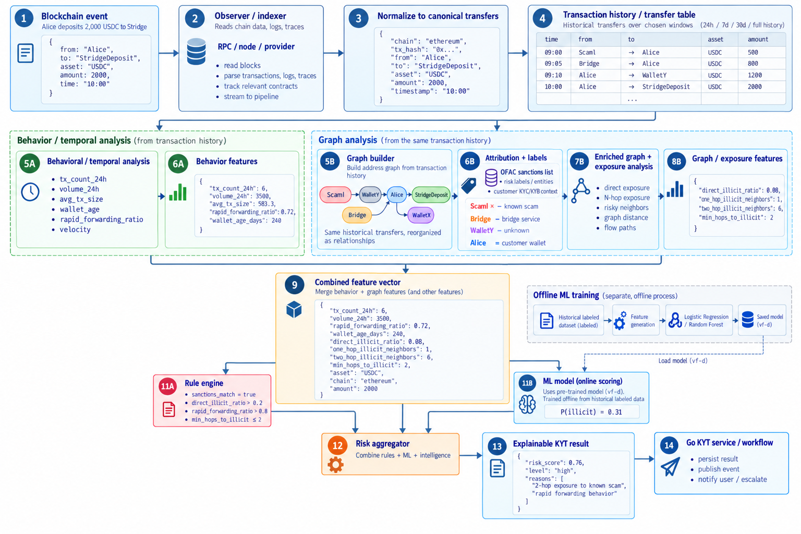

# KYT fundamentals

## 1. KYC, KYB, and KYT - The Core Distinction

> **KYT is not a binary clean/dirty classifier. A professional system combines identity context, blockchain intelligence, exposure, behavior, rules, and possibly machine learning to produce explainable risk information for downstream policy and human review.**

KYC, KYB, and KYT solve related but different compliance and risk problems. The first two establish who a customer or business is; KYT continuously evaluates what money and blockchain transactions are doing.

<mark>KYC</mark> - Who is this person?  

<mark>KYB</mark> - Who is this company?  

<mark>KYT</mark> - What is the money doing?

### 1.1 KYC - Know Your Customer

KYC concerns the <mark>identity and risk profile of an individual</mark>. It answers whether the person is who they claim to be and establishes customer context that later helps interpret transaction behavior.

- Name

- Date of birth

- Identity document

- Country and residence

- Source of funds

- Occupation

- Customer risk classification

Typical questions include whether the identity is genuine, <mark>whether the customer is subject to sanctions,</mark> and whether the customer belongs to a higher-risk category that requires stronger controls.

### 1.2 KYB - Know Your Business

KYB applies similar principles to organizations. It establishes the legal identity, ownership, business purpose, and expected behavior of a <mark>company</mark> or other legal entity.

- Company identity and registration

- Jurisdiction

- Directors

- Beneficial owners

- Business activity

- Expected transaction behavior

<mark>Example</mark>: if a small software consulting company that normally handles modest payments suddenly begins moving very large stablecoin volumes every day, the blockchain activity alone shows volume, while KYB context shows that the activity may be inconsistent with the stated business model.

### 1.3 KYT - Know Your Transaction

KYT is <mark>continuous transaction monitoring</mark> and risk assessment. It examines what funds are doing on-chain, where funds come from, where they go, which counterparties are involved, and whether the behavior matches known risk patterns or customer context.

> **KYC/KYB establishes identity and expected context. KYT evaluates actual transaction behavior and blockchain exposure. Professional systems need both.**

## 2. KYT as Crypto-Native Transaction Monitoring

Financial institutions monitored transactions long before cryptocurrency. Traditional transaction monitoring looks for behavior that deviates from normal customer activity, suspicious flow patterns, unusual counterparties, or other indicators. KYT extends this idea using public blockchain data and blockchain-specific intelligence.

Traditional example: 
Customer normally spends about \$3,000/month  

```text
Suddenly:
\$400,000 enters account
-> rapidly split into 20 transfers
-> sent internationally
```

Result: potentially unusual behavior that may require review.

Crypto adds a highly structured public ledger. A KYT engine may inspect sender, recipient, amount, asset, blockchain, historical activity, counterparties, fund-flow history, and known address or entity attribution.

## 3. Addresses, Wallets, Entities, Attribution, and Labels

The phrase "dirty wallet" is convenient shorthand but is too simplistic for engineering a professional risk system. Risk is multi-dimensional and depends on exposure, behavior, context, evidence, confidence, severity, and policy.

```text
Wallet A
direct sanctions exposure
-> extremely serious
```

```text
Wallet B
received a small fraction of funds through an address
that interacted with a mixer three hops ago
-> context-dependent risk
```

```text
Wallet C
no known illicit counterparty, but behavior resembles laundering
-> behavioral risk
```

```text
Wallet D
interacts with an entity prohibited by company policy
-> policy risk
```

> **A blockchain address is not inherently "clean" or "dirty." Professional KYT evaluates risk category, severity, reasons, exposure, confidence, behavior, and context.**

### 3.1 Address vs wallet vs entity

| **Concept** | **Meaning**                                                  |
| ----------- | ------------------------------------------------------------ |
| <mark>Address</mark> | A blockchain identifier, such as an Ethereum or Bitcoin address. |
| Wallet      | A user-facing wallet or an analytical grouping of one or more addresses believed to be controlled together, depending on context. |
| <mark>Entity</mark>  | The real-world person, organization, service, or illicit actor believed to control one or more addresses. |

```text
Address 1 --\
Address 2 ----+--> Exchange / service / entity
Address 3 --/
```

### <mark>3.2 Wallet attribution</mark>

Wallet attribution links blockchain addresses or clusters to real-world entities using on-chain analysis together with off-chain evidence. Attribution transforms raw ledger activity into information that compliance and risk systems can reason about. <mark>Example</mark>:

```text
Raw blockchain:
0xABC -> 0xDEF
```

```text
Attributed blockchain:
Customer wallet -> Known exchange
```

or  

```text
Customer wallet -> Ransomware-associated cluster
```

The attributed version is far more useful because the system can reason about the type and risk of the counterparty rather than only hexadecimal addresses.

### 3.3 Where labels come from

Professional blockchain-intelligence companies combine many evidence sources. Possible sources include:

- Public blockchain behavior and transaction patterns

- Publicly disclosed addresses

- Sanctions lists

- Law-enforcement information

- Open-source intelligence

- Service disclosures and known deposit addresses

- Investigative research and controlled transactions

- Clustering heuristics

- Other proprietary intelligence

Not every attribution has equal certainty. <mark>A well-designed system records the source, supporting evidence, confidence, and timestamp associated with an attribution.</mark>

> <mark>**Explainability starts at attribution. Risk systems should preserve why an address or entity received a label, how confident the system is, and when that conclusion was established.**</mark>

## 4. Sanctions Intelligence and Time-Aware Attribution

Sanctions authorities can publish digital-currency addresses directly in sanctions-list entries. KYT systems therefore commonly ingest authoritative sanctions intelligence and compare transaction counterparties against current lists.

KYT intelligence table  

### address category  
0xABC sanctioned 
0xDEF ransomware 
bc1XYZ darknet service
0x987 exchange

```text
Customer
|
| sends funds
v
0xABC
|
v
SANCTIONS MATCH
```

A direct sanctions match is typically a very strong risk signal. <mark>However, intelligence changes over time: addresses can be added, updated, removed, or reclassified. Production KYT therefore needs time-aware and versioned intelligence rather than a static list downloaded once.</mark>

> **Risk intelligence is time-sensitive. Historical transactions may need to be re-evaluated when sanctions, labels, attribution, or other intelligence changes.**

## 5. Direct and Indirect Exposure

### 5.1 Direct exposure

<mark>Direct exposure</mark> occurs when the monitored address transacts immediately with a known risky source or destination.

```text
Known ransomware wallet
|
| 10 ETH
v
Customer
```

Direct incoming exposure

```text
Customer
|
| 100 USDC
v
Sanctioned service
```

Direct outgoing exposure

### 5.2 Indirect exposure

<mark>Indirect exposure</mark> exists when the connection to the risky entity passes <mark>through intermediary addresses</mark> or services.

```text
Known ransomware
|
v
Wallet X
|
v
Wallet Y
|
v
Customer
```

Indirect exposure

Indirect exposure can be <mark>described in hops:</mark> one hop, two hops, three hops, and so on. Modern commercial systems may trace through intermediaries until a known service or entity is reached.

### 5.3 Direct and indirect exposure are not equivalent

```text
Case A:
Ransomware -> Customer
```

```text
Case B:
Ransomware -> Wallet 1 -> Wallet 2 -> Wallet 3 -> Large exchange -> Customer
```

Treating these situations identically would be simplistic. Risk interpretation depends on distance, context, intermediary type, direction, amount, percentage exposure, recency, and organization policy.

> <mark>**Direct and indirect exposure are different risk signals. Indirect exposure becomes increasingly context-dependent as funds pass through intermediaries.**</mark>

### 5.4 Exposure amount and percentage

<mark>Absolute amount and proportional exposure both matter. A wallet that received \$100 of remotely risky funds within \$1,000,000 of legitimate activity is not equivalent to a wallet where \$800,000 of \$1,000,000 came directly from a ransomware-related source.</mark>

- Absolute exposed amount

- Percentage of total funds exposed

- Risk category

- Number of hops

- Direction of flow

- Transaction recency

### 5.5 Incoming vs outgoing exposure

```text
Incoming:
Risky service -> Customer
Question: where are the customer's funds coming from?
```

```text
Outgoing:
Customer -> Risky service
Question: where are the funds going?
```

Direction can later become an <mark>explicit feature,</mark> such as incoming_illicit_ratio or outgoing_illicit_ratio.

## 6. Behavioral Risk Signals

Known bad counterparties are only one source of KYT risk. A wallet can show suspicious behavior even when no counterparty has already been labelled illicit. <mark>Behavioral monitoring looks for unusual timing, amounts, velocity, flow structure, and interaction patterns.</mark>

- Rapid movement of funds

- Unusual transaction velocity

- Layering

- Structuring

- Chain hopping

- Many newly created counterparties

- Immediate forwarding of received funds

- Large deviation from the customer's normal behavior

- Interaction with mixers or privacy-enhancing services

### 6.1 Transaction velocity

Normal pattern: 
1-5 transfers per week  

Sudden behavior: 
200 transfers within 20 minutes  

Result: a potentially important behavioral signal.

<mark>Unusual velocity is not proof of wrongdoing. It is an observation that can raise risk depending on context and other signals.</mark>

> **Signal does not equal guilt. KYT produces evidence and indicators; <mark>downstream policy and human review interpret them.</mark>**

### <mark>6.2 Structuring</mark>

Structuring is a pattern in which t<mark>ransactions are deliberately split or shaped to avoid thresholds or controls.</mark> The exact legal definition varies, but the engineering lesson is that transaction sequences may be suspicious even when each individual transfer appears ordinary.

Example threshold: \$10,000  

Observed sequence: 
\$9,900 
\$9,800 
\$9,700 
\$9,600  

The pattern may matter more than any single transaction.

### <mark>6.3 Layering</mark>

```text
Illicit funds
|
v
Wallet A
|
v
Wallet B
|
v
Bridge
|
v
Wallet C
|
v
DEX
|
v
Wallet D
|
v
Exchange
```

<mark>Layering broadly refers to moving funds through multiple steps, services, or assets in ways that obscure their origin or ownership.</mark> A single transfer may look harmless while the full path becomes informative.

### 6.4 Cross-chain obfuscation

```text
Ethereum
|
v
Bridge
|
v
Arbitrum
|
v
DEX
|
v
Solana
```

<mark>Cross-chain movement can be part of legitimate activity or an attempt to make tracing harder.</mark> For a bridge company, bridge use itself cannot be treated as suspicious; context, source, destination, timing, and behavior determine its risk significance.

> **Bridge usage is not inherently suspicious. It is a feature whose meaning depends on source, destination, flow pattern, and broader transaction context.**

### 6.5 Mixers

<mark>Mixers are services designed to make the flow of funds harder to trace by pooling, combining, or obscuring transaction paths. Exposure to mixer-type services can be a risk signal, but mixer interaction alone is not proof of criminal activity.</mark> Treatment depends on policy, jurisdiction, context, and exposure.

## 7. Risk-Based Compliance, Unhosted Wallets, and Policy Context

<mark>The risk-based approach</mark> means organizations identify different levels and types of risk and apply controls proportionately. It does not mean treating every customer or transaction identically.

```text
LOW RISK
-> normal processing
```

```text
MEDIUM RISK
-> additional review
```

```text
HIGH RISK
-> enhanced review / restriction / escalation
```

Exact actions and thresholds depend on jurisdiction, regulation, business model, and internal compliance policy.

### 7.1 Unhosted wallets

An unhosted or self-custody wallet is generally controlled directly by its user rather than through a regulated custodian. The important point for KYT is that less verified identity context may be available for an arbitrary self-custody address than for an account at a regulated intermediary.

```text
Self-custody context:
Customer -> MetaMask / hardware wallet
```

```text
Custodial context:
Customer -> regulated exchange account
```

<mark>A regulated exchange account may provide additional context such as verified customer identity, institution, and jurisdiction.</mark> An unhosted wallet is not inherently illicit; it is simply a context with different information and risk characteristics.

### 7.2 Risk appetite

Different organizations tolerate different categories and levels of risk. A conservative bank, a crypto-native exchange, and a bridge infrastructure provider may configure different thresholds, prohibited categories, indirect exposure sensitivities, and manual-review procedures.

> **The KYT engine produces intelligence. Company policy defines how that intelligence affects transactions and customers.**

## 8. Signals, Rules, Machine Learning, Scores, Alerts, Severity, and Confidence

### 8.1 Risk signal vs rule

> <mark>A signal is observed information.</mark> 
>
> <mark>A rule is logic that interprets one or more signals.</mark>

Signals: 
`direct_ransomware_exposure = 3%` 
`transaction_count_last_hour = 84` 
`customer_country = X` 
`wallet_age = 2 days`  

Rule: 

`IF direct ransomware exposure > 0` 
`THEN raise HIGH severity alert`

Another rule: 
`IF transaction_velocity > threshold` 
`AND wallet_age < 24h` 
`THEN raise behavioral alert`

### <mark>8.2 Rule engine</mark>

```go
Transaction
|
v
Sanctions rule
|
v
Direct exposure rule
|
v
Indirect exposure rule
|
v
Velocity rule
|
v
Volume rule
|
v
Risk result
```

<mark>In Go, each rule can implement a common interface and the engine can evaluate a sequence of independent checks.</mark>

```go
type RiskRule interface {
	Evaluate(ctx context.Context, tx Transaction) Result
}
```

Implementations:  

- SanctionsRule  
- DirectExposureRule  
- VelocityRule  
- MixerExposureRule

### <mark>8.3 Rule vs machine learning</mark>

| **Approach** | **Meaning**                                                  | **Good for**                                                 |
| ------------ | ------------------------------------------------------------ | ------------------------------------------------------------ |
| Rule         | <mark>Human-defined deterministic logic.</mark>                       | <mark>Sanctions, known illicit counterparties, hard policy constraints</mark>, thresholds, known typologies. |
| ML model     | Statistical relationship learned from <mark>labelled examples.</mark> | Complex behavioral combinations, probabilistic classification, patterns that rigid rules may miss. |

<mark>Example rule:</mark> if an address is on a current sanctions list, raise a severe alert. 

<mark>Example ML output:</mark> using transaction frequency, volume, graph relationships, wallet age, and other features, estimate P(illicit) = 0.73.

A deterministic sanctions match should not be delegated to a statistical model. Conversely, a previously unknown address may still exhibit suspicious combinations of behaviors that an ML model can identify.

> <mark>**Mature KYT systems often combine intelligence + deterministic rules + behavioral analysis + machine learning. Neither rules nor ML replaces the other.**</mark>

<mark>So how does ML and rules integrate?</mark>

``` go
Transaction / Wallet
        |
        v
Feature extraction
        |
        +--------------------+
        |                    |
        v                    v
Rule Engine              ML Model
        |                    |
        v                    v
Rule findings          ML probability
        |                    |
        +---------+----------+
                  |
                  v
           Risk Aggregator
                  |
                  v
        final score + reasons
```

more specifically: (this is a very simplified version no lambda architecture no Spark no asyncrounous calculation)



### 8.4 Risk score

There is no universal industry formula in which a score such as 82 has the same meaning everywhere. Vendors and institutions may use 0-100 scores, 0-10 scores, categorical risk levels, alerts, or combinations of these.

```text
Inputs
|- exposure
|- labels
|- rules
|- behavior
|- ML
`- customer context
|
v
RISK RESULT
```

<mark>A risk score is therefore an implementation and policy mechanism rather than a universal mathematical truth.</mark>

### 8.5 Risk score vs risk level

A numerical score can be mapped to a human-readable level. Example educational thresholds:

| **Score** | **Level** |
|-----------|-----------|
| 0-29      | LOW       |
| 30-59     | MEDIUM    |
| 60-79     | HIGH      |
| 80-100    | CRITICAL  |

These thresholds are demonstration values only. Real thresholds must be defined by the organization and its compliance policy.

### 8.6 Risk score vs alert

A score is an overall assessment; an alert identifies a specific condition that deserves attention.

`risk_score = 84`  

alerts:  
- sanctions-related counterparty  
- rapid transaction velocity  
- high one-hop exposure

### 8.7 Risk vs confidence

<mark>Risk and confidence are separate dimensions. A category can be very severe if the attribution is correct while the attribution itself may have limited confidence.</mark>

```go
RISK 
How serious is the activity or category?  

CONFIDENCE 
How certain are we about the evidence, attribution, or classification?
```

## 9. Explainability, Human Review, Case Management, and Model Quality

### 9.1 Explainability

```text
Weak result: 
risk = 91  

Question: why? 
Answer: unknown

Better result: 
risk_score: 91 
reasons:  

- 22% direct exposure to sanctioned entity  
- received funds from ransomware cluster  
- transaction velocity 9x customer baseline  
- ML illicit probability 0.76
```

<mark>Explainability supports human review, audits, debugging, regulatory examination, customer disputes, false-positive analysis, and model improvement. Risk systems should produce evidence, not mysterious numbers.</mark>

> **A good KYT result should include score or level, severity, reasons, exposure evidence, model/rule context, and enough metadata to reproduce or investigate the decision.**

### 9.2 Human-in-the-loop review

When the system generates a higher-risk result, an analyst may inspect customer KYC/KYB, transaction history, graph relationships, counterparties, business purpose, source of funds, previous alerts, and additional intelligence before deciding whether the alert is a false positive, a valid concern, or requires more investigation.

> **KYT is primarily a decision-support system. A high score is not the same as proving criminal conduct.**

### 9.3 False positives

A false positive is legitimate or acceptable activity that the system incorrectly flags as suspicious. <mark>Excessive false positives can overwhelm compliance teams,</mark> increase customer friction, and cause analysts to miss genuinely important cases.

Reducing false positives requires good attribution, sensible thresholds, customer context, behavioral baselines, rule tuning, and alert prioritization.

### 9.7 False negatives

A false negative occurs when the system rates activity as low risk even though it is actually suspicious or illicit. Detection systems therefore balance the cost of false positives against the danger of false negatives.

<mark>Important:</mark>

```text
Higher sensitivity
-> catch more suspicious activity
-> usually more false positives
```

```text
Lower sensitivity
-> fewer alerts
-> potentially more missed activity
```

Later, <mark>precision</mark> and <mark>recall</mark> will give formal ML metrics for this tradeoff.

## <mark>10. Time and Direction in KYT</mark>

### 10.1 Risk changes over time

```text
January 1 
Address 0xABC appears harmless.  

January 10 
Customer sends funds to 0xABC.  

February 15 
New intelligence determines 0xABC belongs to a darknet service.  
```

The January transaction now has new risk context.

<mark>This is why a professional KYT system may need to re-evaluate historical activity when intelligence changes. Historical transaction data must remain available for retrospective analysis.</mark>

### 10.2 Real-time vs retrospective monitoring

```text
REAL-TIME
new transaction
      |
      v
current rules + current intelligence + ML
      |
      v
risk score
      |
      +--> allow
      +--> hold
      +--> review
      +--> block
```

```text
RETROSPECTIVE
new intelligence arrives
|
v
rescan historical activity
|
v
identify past exposure
|
v
new alert
```

Both modes are important. Real-time monitoring affects current transactions; <mark>retrospective monitoring finds risk that becomes visible only after new information is discovered.</mark>

### 10.3 Pre-transaction vs post-transaction screening

```text
PRE-TRANSACTION
Customer requests withdrawal
|
v
screen destination
|
v
risk decision
|
v
broadcast or stop
```

```text
POST-TRANSACTION
deposit arrives
|
v
analyze source
|
v
alert if risky
```

<mark>A payments or bridge infrastructure company can need both incoming-deposit KYT and outgoing-destination screening.</mark>

## 11. Example

```text
DepositConfirmed
|
v
KYT Service
|
|- Who sent it?
|- Known label?
|- Sanctions match?
|- Direct exposure?
|- Indirect exposure?
|- Suspicious behavior?
`- Customer context?
|
v
RESULT
```

```json
{
"risk_score": 76,
"level": "high",
"alerts": [
"direct exposure to high-risk service",
"unusual transaction velocity"
]
}
```

```text
Settlement workflow
|
|- low -> continue
|- medium -> policy-dependent review
`- high -> hold / review / escalate
```

### 11.1 Information a KYT engine consumes

| **Category**     | **Examples**                                                 |
| ---------------- | ------------------------------------------------------------ |
| Transaction data | Transaction hash, chain, block/time, sender, receiver, asset, amount. |
| Attribution data | Known entity, entity type, risk category, attribution confidence. |
| Exposure data    | Direct/indirect counterparties, hops, amounts, percentage exposure. |
| Behavioral data  | History, frequency, velocity, volume, timing, counterparty diversity. |
| Customer data    | KYC/KYB profile, country, business type, expected behavior, previous alerts. |
| <mark>Intelligence</mark> | <mark>Sanctions</mark>, scams, ransomware, hacks, darknet, mixers, fraud, other high-risk services. |

### 11.2 Professional result structure

Avoid designing the eventual API as a Boolean such as {"dirty": true} or as an unexplained number. The direction <mark>should be an explainable, versioned risk result with evidence.</mark>

```json
{
"address": "0xABC...",
"risk_score": 89,
"risk_level": "critical",
"confidence": 0.92,
"reasons": [
"direct sanctions exposure",
"high-risk counterparty interaction",
"abnormal transaction velocity"
],
"exposures": [
{
"category": "sanctions",
"type": "direct",
"amount_usd": 12000
}
],
"model_version": "risk-v4",
"evaluated_at": "..."
}
```

The capstone can use a simpler schema, but the professional direction is to return evidence, not an opaque score.

## 12 Primary references

**Chainalysis - KYT and transaction monitoring:** https://www.chainalysis.com/product/kyt/

**Chainalysis - Transaction Monitoring:** https://www.chainalysis.com/glossary/transaction-monitoring/

**Chainalysis - Wallet Attribution:** https://www.chainalysis.com/glossary/wallet-attribution/

**TRM Labs - Know Your Transaction:** https://www.trmlabs.com/glossary/know-your-transaction-kyt

**TRM Labs - Glass Box Attribution:** https://www.trmlabs.com/glossary/glass-box-attribution

**FATF - Virtual Assets:** https://www.fatf-gafi.org/en/topics/virtual-assets.html

**OFAC - Digital Currency Addresses FAQ:** https://ofac.treasury.gov/faqs/topic/1626
