# KYT graphs

By the end, you should be able to explain this entire flow:

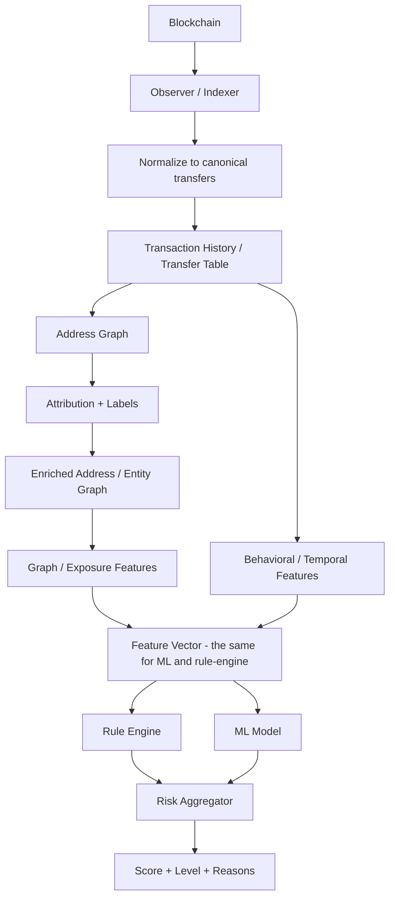

> <mark>**The graph is not an optional visualization. It is a computational representation of who transacted with whom, how much, when, and how those counterparties connect to known entities.**</mark>

more specifically: (this is a simplified version without Spark involvement and the lambda architecture)


## 1. What exactly is a blockchain graph?

A graph consists of:

- <mark>Nodes</mark> — things in the network.
- <mark>Edges</mark> — relationships between those things.
- <mark>Attributes</mark> — metadata attached to nodes or edges.

For KYT, the most useful nodes are usually:

- blockchain addresses,
- transactions,
- attributed entities or clusters,
- sometimes tokens, contracts, or services.

The most important edge is usually:

> **value moved from one participant to another.**

A simplified address graph:

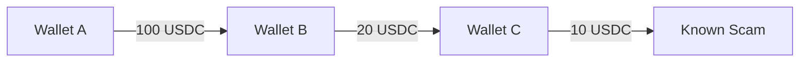

Graph notation:

```text
G = (V, E)

V = set of nodes
E = set of edges
```

For an address graph:

```text
V = blockchain addresses / entities

E = transfers between them
```

A transfer edge should normally carry metadata such as:

```text
from

to

amount

asset

timestamp

block number

transaction hash

chain
```

A better representation is therefore:

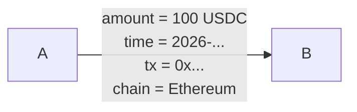

A KYT graph is usually directed, weighted, and temporal.

| Property | Meaning |
|---|---|
| Directed | A → B is different from B → A. |
| Weighted | The amount/value transferred matters. |
| Temporal | The time and ordering of transfers matter. |
| Labelled | Some addresses/entities have known categories or risk intelligence. |

## 2. Three graph representations you should recognize

### <mark>2.1 Address-to-address graph</mark>

Nodes are addresses. Edges represent value movement.

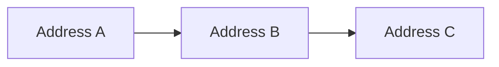

This is the easiest representation for explaining:

- counterparties,
- direct exposure,
- N-hop exposure,
- fan-in/fan-out,
- graph distance,
- risky-neighbor counts.

Elliptic++ provides an address-address edge list for its Actors dataset.

### <mark>2.2 Transaction-to-transaction graph</mark>

Nodes are transactions.

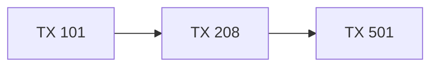

This representation is particularly natural for <mark>Bitcoin/UTXO flow analysis,</mark> where outputs of earlier transactions become inputs to later transactions.

Elliptic++ also provides a transaction graph containing more than 200,000 transaction nodes.

### <mark>2.3 Address-transaction bipartite graph</mark>

Address and transaction nodes are separate.

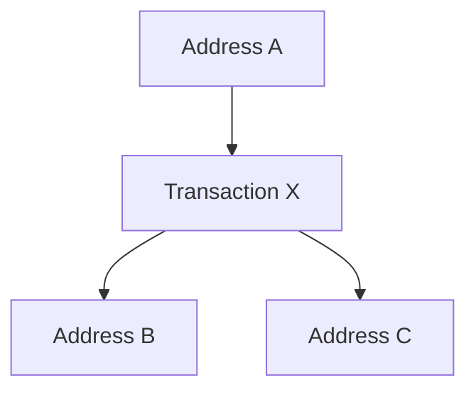

This preserves more of the underlying transaction structure than immediately projecting everything into address-to-address edges.

Elliptic++ provides both address-to-transaction and transaction-to-address edge lists for this purpose.

> **Do not become obsessed with picking one universal graph representation. Different analysis jobs use different projections of the same blockchain data.**

---

## 3. Bitcoin/UTXO vs EVM account graphs

### 3.1 Bitcoin / UTXO model

A Bitcoin transaction can have multiple inputs and multiple outputs.

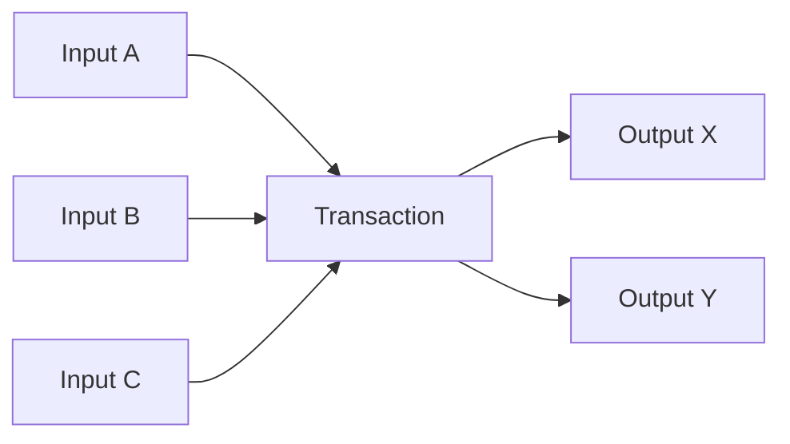

The graph is not literally a simple bank transfer from one address to one address.

Important complications include:

- multiple inputs,
- multiple outputs,
- change addresses,
- UTXO ownership heuristics,
- address clustering uncertainty.

Therefore:

> **An address-address edge derived from a UTXO transaction is an analytical projection, not necessarily proof that one human directly paid another human.**

### 3.2 Ethereum / account model

Ethereum looks more naturally account-to-account:

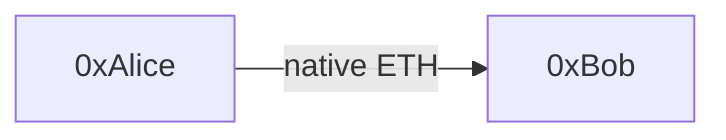

But real activity also includes:

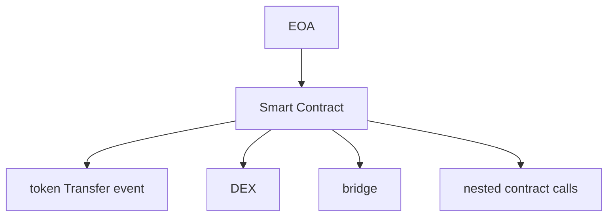

For tokens such as ERC-20 assets, <mark>important transfers are often represented by contract logs/events rather than only the top-level transaction `value` field.</mark>

Internal execution traces can also contain economically meaningful value movements.

### 3.3 Professional normalization strategy

Instead of forcing every chain to look identical at the RPC level, normalize chain-specific data into a canonical transfer/event model.

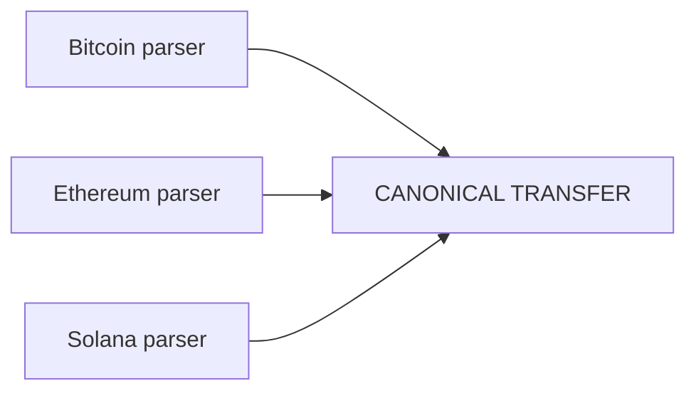

<mark>Example canonical transfer:</mark>

```json
{
  "chain": "ethereum",
  "tx_hash": "0x...",
  "from": "0xAlice",
  "to": "0xBob",
  "asset": "USDC",
  "amount": "100.00",
  "timestamp": "...",
  "block_number": 123456
}
```

This normalized representation is what downstream KYT processing should reason about.

> <mark>**Chain-specific extraction happens at the edge of the data system. Risk logic should operate on normalized domain data whenever possible.**</mark>

## 4. Address, cluster, service, and entity

The graph layer makes this distinction even more important.

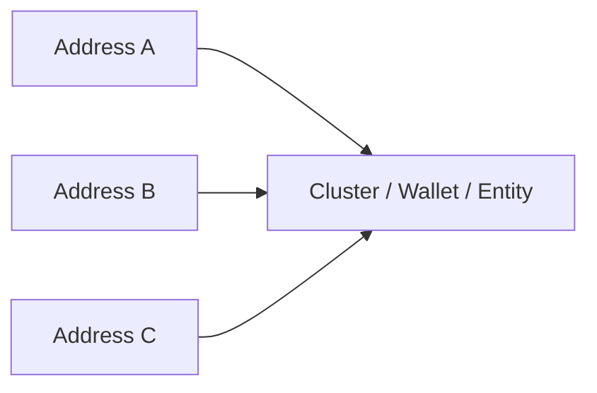

A commercial blockchain-intelligence system may infer that multiple addresses belong to:

```text
Exchange X
Mixer Y
Scam Z
Ransomware Group Q
```

But clustering and attribution involve uncertainty.

Therefore an intelligence record should conceptually look more like:

```json
{
  "address": "0xABC...",
  "entity_id": "entity_918",
  "entity_type": "exchange",
  "risk_category": "low",
  "source": "provider-x",
  "confidence": 0.94,
  "valid_from": "...",
  "valid_to": null
}
```

rather than:

```text
0xABC = bad
```

---

## 5. Label enrichment

Once you have normalized transfers, enrich addresses using intelligence.

Raw:

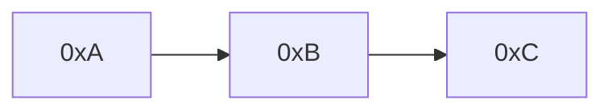

After label enrichment:

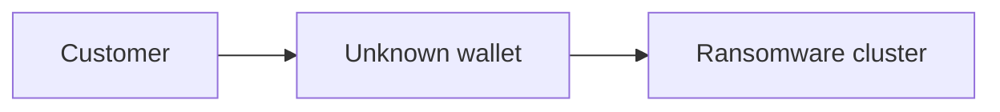

Typical label categories for the capstone:

- licit/known-good dataset label,
- illicit dataset label,
- sanctioned,
- ransomware,
- scam,
- darknet,
- mixer,
- hack/stolen funds,
- exchange,
- bridge,
- DEX/service,
- unknown.

For production-quality data modelling, labels should include:

- label/category,
- source,
- attribution timestamp,
- confidence,
- provider/intelligence version,
- optional entity/cluster identifier.

> <mark>**Labels are data. Rules interpret labels. Do not hard-code intelligence assumptions deep inside graph traversal code.**</mark>

## 6. Direct exposure

Direct exposure asks:

> **Who did this address directly transact with?**

Example:

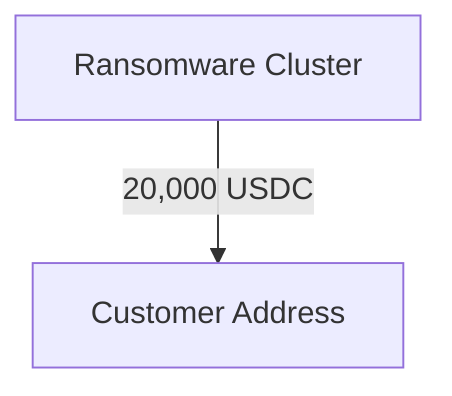

Direct incoming risky amount:

```text
20,000 USDC
```

If total incoming volume was:

```text
100,000 USDC
```

<mark>The **100,000 USDC** means the customer address received **100,000 USDC in total from all sources** during whatever time window you're measuring.</mark>

then a simple direct exposure ratio is:

```text
direct_ransomware_exposure_ratio
= 20,000 / 100,000
= 0.20
```

or:

```text
20%
```

<mark>Useful direct features:</mark>

```text
direct_illicit_in_amount
direct_illicit_out_amount
direct_illicit_in_ratio
direct_illicit_out_ratio
direct_sanctions_count
direct_risky_counterparty_count
```

<mark>Direction matters.</mark>

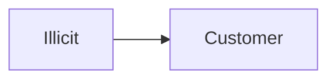

and:

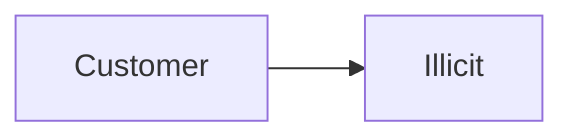

are separate signals.

## 7. Indirect / N-hop exposure

Direct counterparties are not enough.

Example:

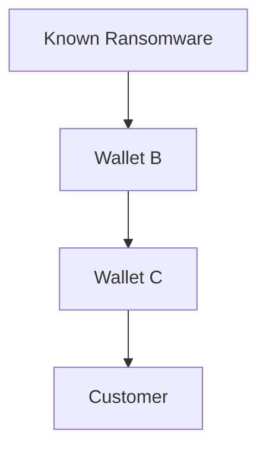

The customer is three graph edges away from the ransomware address in this simplified projection.

### 7.1 Hop

A hop is one graph edge in the chosen graph representation.

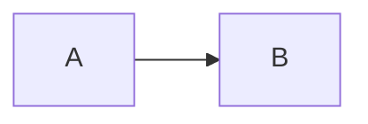

B is one hop from A.

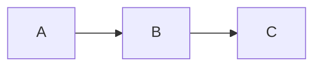

C is two hops from A.

### 7.2 Breadth-first search intuition

For an unweighted graph, breadth-first search (BFS) is a natural way to find the shortest hop distance from a target address to labelled nodes.

**<mark>Transaction neighborhood graph:</mark>** Starting from the customer address, we traverse its transaction counterparties outward hop by hop. <mark>(we track all the Txs related to the user and build a big tree-graph like structure)</mark>BFS explores all addresses at depth 1 first, then depth 2, then depth 3, until it finds a labelled risky address or reaches a configured maximum depth. In this example, the shortest route is `Customer → B → E → Known Scam`, so `distance_to_known_scam = 3`.

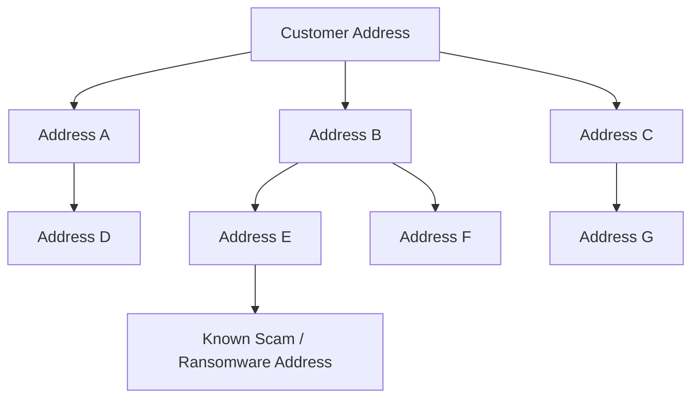

<mark>A naive BFS can explode roughly like $b^d$, so real KYT systems **do not expand the full graph indefinitely**.</mark>

They control it with things like:

- **Small hop limits** — often only 1–3 hops for a specific analysis.
- **Amount thresholds** — ignore dust/tiny flows.
- **Time windows** — e.g. only transactions from the last 30/90 days.
- **Top counterparties** — keep only materially important neighbors.
- **Stop conditions** — stop when reaching a known entity/service such as a large exchange.
- **Precomputed graph features** — don't rebuild the entire graph per request; continuously compute/store exposure, neighbors, labels, etc.
- **Graph databases / distributed processing** — historical graph traversal is done offline/batch with systems designed for it.
- **Caching** — if Address A's 2-hop neighborhood was recently calculated, reuse it.
- **Risk-guided expansion** — expand suspicious branches more deeply and ignore obviously irrelevant ones.

Then:

```text
distance_to_known_scam = 3
```

This is useful, but it is not yet the same thing as financial exposure.

> <mark>**Graph distance answers “how close?” It does not automatically answer “how much of this wallet's funds came from that source?”**</mark>

### 8. Distance vs flow-aware exposure

This distinction is extremely important.

Consider:

```mermaid
flowchart TD
    I[Illicit] -->|$1| A[A]
    A -->|$1| C[Customer]
```

versus:

```mermaid
flowchart TD
    I[Illicit] -->|$900,000| B[B]
    B -->|$900,000| C[Customer]
```

Both are two-hop paths. They should not automatically create the same exposure feature. A realistic system considers:

- amount/value,
- direction,
- path,
- asset,
- time,
- intermediary type,
- percentage of the target wallet's total flow,
- whether value can reasonably be attributed through the path.

### 8.1 Educational capstone approach

<mark>For our project, we can calculate both:</mark>

```text
GRAPH FEATURES
- shortest_distance_to_illicit
- risky_nodes_within_1_hop
- risky_nodes_within_2_hops
- risky_nodes_within_3_hops

FLOW FEATURES
- direct_risky_volume
- one_hop_risky_volume
- two_hop_risky_volume
- direct_risky_ratio
- one_hop_risky_ratio
```

The graph features describe topology.

The flow features attempt to describe value exposure.

### 8.2 Avoid double-counting

Suppose two paths converge:

```mermaid
flowchart LR
	I[Illicit] -->|$100| B[B]
    I -->|$40| C[C]
    B -->|$40| D[D]
    C -->|$20| D
    D -->|$10| U[Customer]
```

Naively summing every path can count the same downstream value more than once.

### How to calculate 3-Hop (or more) illicit ratio?

<mark>Example:</mark>

### 

Suppose the transaction graph is:

```mermaid
flowchart LR
    H[Unrelated source] -->|$500| B[B]
    I[Illicit source] -->|$100| B
    I -->|$40| C[C]
    H2[Unrelated source 2] -->|$500| C
    B -->|$40| D[D]
    C -->|$20| D
    D -->|$10| U[Customer]
```

The key complication is that both `B` and `C` receive a mixture of clean and illicit funds.Therefore, we need an attribution rule to estimate how much illicit value continues through the graph.

For this example, we use **proportional tracing**.

> **Proportional tracing:** when an address contains both clean and illicit funds, each outgoing transfer is assumed to contain the same illicit percentage as the address's mixed incoming funds.

---

#### Step 1 — Calculate illicit proportion at B

`B` receives:

```text
$500 clean
$100 illicit
-----------
$600 total
```

The illicit proportion at `B` is:

```text
100 / 600
= 0.1667
= 16.67%
```

`B` sends `$40` to `D`.

Therefore, the estimated illicit part of this transfer is:

```text
$40 × 16.67%
≈ $6.67
```

So:

```text
B → D

Total transfer:   $40
Illicit portion: ≈ $6.67
Clean portion:   ≈ $33.33
```

---

#### Step 2 — Calculate illicit proportion at C

`C` receives:

```text
$500 clean
$40 illicit
-----------
$540 total
```

The illicit proportion at `C` is:

```text
40 / 540
≈ 0.0741
≈ 7.41%
```

`C` sends `$20` to `D`.

Therefore:

```text
$20 × 7.41%
≈ $1.48
```

So:

```text
C → D

Total transfer:   $20
Illicit portion: ≈ $1.48
Clean portion:   ≈ $18.52
```

---

#### Step 3 — Combine the funds arriving at D

`D` receives:

```text
From B:
$40 total
$6.67 illicit

From C:
$20 total
$1.48 illicit
```

Therefore, the total amount received by `D` is:

```text
$40 + $20
= $60
```

The total estimated illicit amount inside that `$60` is:

```text
$6.67 + $1.48
= $8.15
```

So the illicit proportion at `D` is:

```text
8.15 / 60
≈ 0.1358
≈ 13.58%
```

Therefore:

```text
D's funds:

Total:   $60
Illicit: $8.15
Clean:   $51.85

Illicit ratio:
13.58%
```

---

#### Step 4 — D sends $10 to the Customer

`D` sends:

```text
$10
```

to the customer.

Since `13.58%` of `D`'s mixed funds are estimated to be illicit, proportional tracing gives:

```text
$10 × 13.58%
≈ $1.36
```

Therefore:

```text
D → Customer

Total transfer:          $10
Estimated illicit part: ≈ $1.36
Estimated clean part:   ≈ $8.64
```

So the amount of illicit-origin funds that actually reaches the customer is approximately:

```text
$1.36
```

---

#### Step 5 — Calculate the 3-hop illicit exposure ratio

The paths are:

```text
Illicit → B → D → Customer

Illicit → C → D → Customer
```

Both reach the customer after `3 hops`.

Suppose the customer received:

```text
$1,000 total
```

from all sources during the same measurement window.

The customer's 3-hop illicit exposure amount is:

```text
≈ $1.36
```

Therefore:

```text
3-hop illicit exposure ratio
=
illicit amount reaching customer
--------------------------------
total incoming amount
```

So:

```text
3-hop illicit exposure ratio

= 1.36 / 1000

= 0.00136

= 0.136%
```

Final result:

```text
3-hop illicit exposure amount ≈ $1.36

3-hop illicit exposure ratio  ≈ 0.136%
```

## 9. Why tracing may stop at a service boundary

Imagine funds enter a large centralized exchange:

```mermaid
flowchart TD
    I[Illicit Wallet] --> E[Exchange deposit address]
    E -. ? .-> W[Another exchange withdrawal]
```

<mark>Once value enters a custodial service, public blockchain data does not expose the service's internal customer ledger. Therefore the relationship between a later withdrawal and a particular earlier deposit cannot generally be reconstructed from blockchain data alone.</mark>

Conceptually:

```mermaid
flowchart LR
    C[Customer] --> E[Exchange]
    E --> P[(Private Exchange Accounting)]
    P --> W[Withdrawal]

    subgraph ON["ON-CHAIN"]
        C
        E
    end

    subgraph OFF["OFFCHAIN&nbsp;INTERNAL&nbsp;LEDGER"]
        P
        W
    end
```

This is why <mark>entity/service attribution</mark> is important and why blindly following addresses forever can produce misleading conclusions.

---

## 10. Graph features for KYT

Graph structure can be converted into numerical features.

### <mark>10.1 Counterparty features</mark>

```text
unique_in_counterparties
unique_out_counterparties
risky_counterparty_count
sanctioned_counterparty_count
new_counterparty_ratio
```

### <mark>10.2 Degree / fan-in / fan-out</mark>

For a directed graph:

```text
in-degree
= number of incoming neighbors/edges

out-degree
= number of outgoing neighbors/edges
```

Large fan-in:

```mermaid
flowchart LR
    A[A] --> T[Target]
    B[B] --> T
    C[C] --> T
    D[D] --> T
    E[E] --> T
```

Large fan-out:

```mermaid
flowchart LR
    T[Target] --> B[B]
    T --> C[C]
    T --> D[D]
```

These are not automatically suspicious. An exchange naturally has huge fan-in and fan-out. Context matters.

### <mark>10.3 Risk-neighborhood features</mark>

```text
direct_illicit_neighbors
one_hop_illicit_neighbors
two_hop_illicit_neighbors
minimum_hops_to_illicit
minimum_hops_to_sanctions
risky_neighbor_ratio
```

### <mark>10.4 Exposure features</mark>

```text
direct_illicit_in_ratio
direct_illicit_out_ratio
one_hop_risky_volume
two_hop_risky_volume
mixer_exposure_ratio
ransomware_exposure_ratio
sanctions_exposure_amount
```

### 10.5 Graph position features

Optional later features can include:

```text
PageRank
centrality
community/cluster membership
```

## 11. Temporal transaction-history features

<mark>KYT is not only a static graph. Blockchain activity evolves over time. For each wallet, calculate windows such as:</mark>

```text
last 10 minutes
last 1 hour
last 24 hours
last 7 days
last 30 days
lifetime
```

Useful features:

```text
tx_count_1h
tx_count_24h
incoming_volume_24h
outgoing_volume_24h
unique_counterparties_24h
wallet_age_days
average_tx_value
maximum_tx_value
incoming_outgoing_ratio
```

### <mark>11.1 Velocity</mark>

```text
velocity = transaction activity / time window
```

Example:

```text
normal:
4 transactions / day

current:
150 transactions / hour
```

### <mark>11.2 Rapid forwarding</mark>

Suppose a wallet receives value and immediately sends most of it onward.

```mermaid
flowchart LR
    A[A] -->|100| T[Target]
    T -->|95 shortly after| B[B]
```

Possible feature:

```text
rapid_forwarding_ratio = 95 / 100 = 0.95
```

This is not proof of laundering; many legitimate automated systems forward funds rapidly. But it is a useful behavioral feature.

### <mark>11.3 Burst behavior</mark>

```mermaid
flowchart TD
    Q[quiet for 90 days] --> L[large incoming transfer] --> O[50 outgoing transfers in 5 minutes]
```

## 12. Elliptic++

Elliptic++ is useful because it provides both transaction and wallet/address graph data with labels and numerical features.

### 12.1 Transactions dataset (for BTC)

The repository reports approximately:

| Field | Size |
|---|---:|
| Transaction nodes | 203,769 |
| Money-flow edges | 234,355 |
| Time steps | 49 |
| Illicit | 4,545 |
| Licit | 42,019 |
| Unknown | 157,205 |
| Features | 183 |

### 12.2 Actors / wallet dataset

The Actors dataset reports:

| Field | Size |
|---|---:|
| Wallet addresses | 822,942 |
| Temporal interaction nodes | 1,268,260 |
| Address-address edges | 2,868,964 |
| Address-transaction-address edges | 1,314,241 |
| Time steps | 49 |
| Illicit | 14,266 |
| Licit | 251,088 |
| Unknown | 557,588 |
| Features | 56 |

Classes:

```text
class 1 = illicit
class 2 = licit
class 3 = unknown
```

The repository also provides tutorials for:

- graph visualization,
- dataset statistics,
- wallet classification,
- transaction classification,
- feature analysis,
- case analysis.

### 12.3 What we actually need from it

For this sprint, prioritize the Actors dataset:

```text
wallets_features.csv
wallets_classes.csv
AddrAddr_edgelist.csv
```

Optionally inspect:

```text
AddrTx_edgelist.csv
TxAddr_edgelist.csv
```

to understand the richer address-transaction graph.

**Do not spend hours studying every existing notebook. Understand the files and use the data to build our own flow.**

#### <mark>wallet_features.csv:</mark>

Illustrative example — these numbers are made up just to show the structure:

```
address,time_step,1,2,3,4,...,56
wallet_A,5,0.17,2.31,0.08,15.2,...,0.91
wallet_B,5,0.03,0.72,1.20,4.6,...,0.15
wallet_A,6,0.21,3.10,0.10,18.7,...,1.02
```

Notice:

```
wallet_A at time step 5
```

and:

```
wallet_A at time step 6
```

are two different **temporal snapshots of the same wallet**.

Conceptually​​

```
wallet_A

Time 5:
[feature1, feature2, ... feature56]

Time 6:
[feature1, feature2, ... feature56]
```

#### <mark>wallet_classes.csv</mark>

It tells you the known label for each address:

```
address,class
```

where:

```
1 = illicit
2 = licit
3 = unknown
```

The label is attached to the address, not separately to every time snapshot.

#### <mark>AddrAddr_edgelist.csv</mark>

This builds the **wallet-to-wallet graph**.

Schema:

```
address1,address2
```

Each row means there is a directed interaction from `address1` to `address2`. 

<mark>**the Elliptic++ `AddrAddr_edgelist.csv` alone is not enough** for real fund-flow/exposure calculations.</mark>

It only tells you:

```
A → B
```

It does **not** tell you:

```
when?
how much?
which asset?
which transaction?
how many times?
```

<mark>So you cannot calculate things like `3-hop illicit exposure ratio` from that edge list alone.</mark> 

## 13 . References

**Elliptic++ Dataset:** https://github.com/git-disl/EllipticPlusPlus

**Chainalysis - Indirect Exposure:** https://www.chainalysis.com/blog/cryptocurrency-risk-blockchain-analysis-indirect-exposure/

**Chainalysis KYT:** https://www.chainalysis.com/product/kyt/
