# Lambda  Architecture and Data Pipeline

## 13. Why PostgreSQL is not your blockchain history warehouse

Suppose your KYT system tracks:

```text
millions of addresses
billions of transfers
multiple blockchains
raw RPC responses
labels
feature snapshots
model-training tables
historical rescoring
```

Your online application database and your large historical analytics store have different jobs.

### PostgreSQL / RDS

Good for:

```text
customers
settlements
current KYT results
alerts
cases
business state
transactional updates
```

### Data lake / object storage

Good for:

```text
raw blockchain history
large Parquet datasets
historical transfers
feature tables
ML training datasets
model artifacts
reprocessing
```

<mark>PostgreSQL is primarily the operational database. The data lake is the historical analytical foundation.</mark>

## <mark>14. Why keep raw blockchain history?</mark>

These are the KYT triggers:

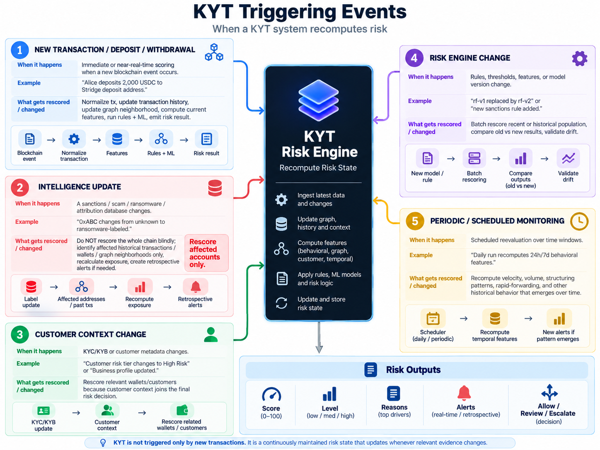

risk intelligence changes over time. Example:

```text
January:
0xABC = unknown

February:
0xABC = attributed ransomware address
```

Now historical activity may need to be re-evaluated. If raw historical chain data was discarded, retrospective analysis becomes much harder. This is one of the main reasons the Bronze layer exists.

## 15. Data lake mental model

A data lake is large-scale storage for raw and processed datasets. In AWS, possible layout:

```text
s3://kyt-data/

    bronze/
        ethereum/
        bitcoin/
        solana/

    silver/
        transfers/
        addresses/
        labels/

    gold/
        wallet_features/
        exposure_features/
        training_sets/
```

You do not need a literal folder structure exactly like this, but the conceptual separation matters.

## <mark>16. Bronze / Silver / Gold architecture</mark>

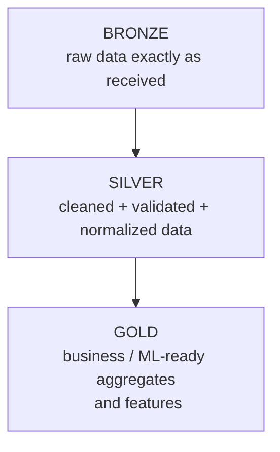

### 16.1 Bronze

Purpose: <mark>preserve source data.</mark>

Examples:

```text
raw block JSON
raw transaction JSON
raw token logs
raw provider responses
raw label feeds
raw Kafka events
```

Example:

```json
{
  "source": "ethereum-rpc",
  "ingested_at": "...",
  "payload": { "raw": "original provider response" }
}
```

<mark>**Do not aggressively “clean” Bronze. Its value is preserving what arrived.**</mark>

### 16.2 Silver

Purpose: create trustworthy <mark>normalized datasets.</mark> Example Silver transfer:

```json
{
  "chain": "ethereum",
  "tx_hash": "0x...",
  "from": "0xAlice",
  "to": "0xBob",
  "asset": "USDC",
  "amount": 100.0,
  "timestamp": "..."
}
```

Silver should provide clean building blocks such as:

```text
transfers
addresses
entities
labels
blocks
transactions
```

### 16.3 Gold

Purpose:

> datasets designed for a specific analytical, business, or ML use.

For KYT:

```text
wallet_risk_features
address_daily_activity
counterparty_features
n_hop_exposure_features
model_training_dataset
entity_risk_summary
```

Example Gold row:

```text
wallet = A

tx_count_24h = 92
incoming_volume_24h = 125000
unique_counterparties_24h = 41
direct_illicit_ratio = 0.14
two_hop_illicit_neighbors = 7
rapid_forwarding_ratio = 0.81
```

This can be fed directly to:

```text
rules
ML training
online feature serving
analyst dashboards
```

The bronze/silver/gold boundries: (with the simplified architecture)

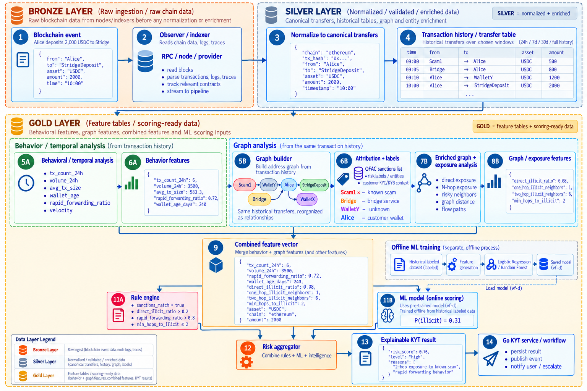

## 17. Why Spark?

Imagine processing:

```text
5 TB of blockchain transfer history
```

with:

```python
pandas.read_csv(...)
```

One machine becomes the bottleneck. Spark is designed to execute structured data computations across distributed resources. The key abstraction for us is the <mark>DataFrame</mark>.

<mark>A Spark DataFrame is conceptually like a table with named columns, but the computation can be distributed.</mark>

Example:

```text
+---------+---------+--------+-------+
| from    | to      | amount | chain |
+---------+---------+--------+-------+
| A       | B       | 100    | ETH   |
| B       | C       | 25     | ETH   |
+---------+---------+--------+-------+
```

<mark>You write transformations describing the result you want. Spark handles execution planning and distributing the work.</mark>

## 18. Spark concepts you actually need

Do not study all of Apache Spark. Learn these:

```python
SparkSession
DataFrame
select
filter
withColumn
groupBy
agg
join
window functions
read CSV / JSON / Parquet
write Parquet
readStream
writeStream
checkpointing
```

## 19. How KYT features map to DataFrame operations

``` python
from pyspark.sql import SparkSession
from pyspark.sql import functions as F
from pyspark.sql.window import Window


# ---------------------------------------------------------
# 1. SparkSession
# Entry point to Spark. Almost every PySpark program starts here.
# ---------------------------------------------------------

spark = (
    SparkSession.builder
    .appName("KYTFeaturePipeline")
    .getOrCreate()
)


# ---------------------------------------------------------
# 2. READ DATA
# Each read returns a Spark DataFrame.
# ---------------------------------------------------------

# Read CSV
transfers = (
    spark.read
    .option("header", True)
    .option("inferSchema", True)
    .csv("data/transfers.csv")
)

# Read JSON
transactions_json = spark.read.json("data/transactions.json")

# Read Parquet
historical_features = spark.read.parquet(
    "data/gold/wallet_features"
)


# Example transfers DataFrame:
#
# chain      from    to      asset   amount   timestamp
# ethereum   Alice   Bob     USDC    100      ...
# ethereum   Scam1   Alice   USDC    500      ...
# bitcoin    X       Y       BTC     0.2      ...


# ---------------------------------------------------------
# 3. SELECT
# Keep only columns we care about.
# ---------------------------------------------------------

selected = transfers.select(
    "chain",
    "from",
    "to",
    "asset",
    "amount",
    "timestamp"
)


# ---------------------------------------------------------
# 4. FILTER
# Keep only Ethereum USDC transfers.
# ---------------------------------------------------------

eth_usdc = transfers.filter( # this is WHERE in SQL
    (F.col("chain") == "ethereum")
    & (F.col("asset") == "USDC")
)


# ---------------------------------------------------------
# 5. withColumn
# Add or transform a column.
#
# Here we convert amount into a Double so Spark can
# perform numerical aggregation on it.
# ---------------------------------------------------------

clean_transfers = transfers.withColumn(
    "amount",
    F.col("amount").cast("double")
)


# You can also derive a completely new feature:
clean_transfers = clean_transfers.withColumn(
    "is_large_tx",
    F.col("amount") > 10_000
)


# ---------------------------------------------------------
# 6. groupBy + agg
#
# Question:
# "How much money did every wallet receive?"
#
# Group rows by destination wallet and calculate:
# - total received
# - number of incoming transactions
# - average transaction size
# ---------------------------------------------------------

wallet_received = (
    clean_transfers
    .groupBy("to")
    .agg(
        F.sum("amount").alias("total_received"),
        F.count("*").alias("incoming_tx_count"),
        F.avg("amount").alias("avg_received_tx")
    )
)


# Example result:
#
# to       total_received   incoming_tx_count   avg_received_tx
# Alice    10500            14                  750
# Bob      91000            20                  4550


# ---------------------------------------------------------
# 7. JOIN
#
# Suppose labels contains:
#
# address    category
# Scam1      ransomware
# Mixer1     mixer
# Binance1   exchange
#
# We join transaction destinations with attribution data.
# ---------------------------------------------------------

labels = spark.read.parquet("data/silver/address_labels")


enriched = (
    clean_transfers.alias("t")
    .join(
        labels.alias("l"),

        # Match transaction destination against known address
        F.col("t.to") == F.col("l.address"),

        # Keep transfers even if the destination has no label
        "left"
    )
    .select(
        "t.*",
        F.col("l.category").alias("to_category")
    )
)


# Result:
#
# from    to       amount    to_category
# Alice   Scam1    100       ransomware
# Bob     Binance1 500       exchange
# Alice   Unknown  50        null


# ---------------------------------------------------------
# 8. DIRECT EXPOSURE FEATURE
#
# Now that transfers are joined with labels,
# calculate how much each sender sent to illicit entities.
# ---------------------------------------------------------

direct_exposure = (
    enriched
    .filter(
        F.col("to_category").isin(
            "ransomware",
            "scam",
            "darknet",
            "sanctioned"
        )
    )
    .groupBy("from")
    .agg(
        F.sum("amount").alias("direct_illicit_amount"),
        F.countDistinct("to").alias(
            "direct_illicit_counterparties"
        )
    )
)


# ---------------------------------------------------------
# 9. WINDOW FUNCTION
#
# Window functions operate over related rows without
# collapsing them like groupBy does.
#
# Example:
# Calculate Alice's cumulative outgoing volume over time.
# ---------------------------------------------------------

wallet_window = (
    Window
    .partitionBy("from")
    .orderBy("timestamp")
    .rowsBetween(
        Window.unboundedPreceding,
        Window.currentRow
    )
)


with_running_volume = clean_transfers.withColumn(
    "cumulative_sent",
    F.sum("amount").over(wallet_window)
)


# Example:
#
# from    amount    cumulative_sent
# Alice   100       100
# Alice   500       600
# Alice   200       800


# ---------------------------------------------------------
# 10. TIME WINDOW AGGREGATION
#
# Different from the Window class above.
#
# Question:
# "How much activity occurred per wallet every 24 hours?"
# ---------------------------------------------------------

daily_features = (
    clean_transfers
    .groupBy(
        "from",

        # Create 24-hour event-time windows
        F.window(
            F.col("timestamp"),
            "24 hours"
        )
    )
    .agg(
        F.count("*").alias("tx_count_24h"),
        F.sum("amount").alias("volume_24h"),
        F.avg("amount").alias("avg_tx_size_24h"),
        F.countDistinct("to").alias(
            "unique_counterparties_24h"
        )
    )
)


# ---------------------------------------------------------
# 11. WRITE PARQUET
#
# Store calculated Gold features.
# ---------------------------------------------------------

daily_features.write.mode("overwrite").parquet(
    "data/gold/wallet_daily_features"
)


# ---------------------------------------------------------
# 12. READSTREAM
#
# Batch:
# spark.read
#
# Streaming:
# spark.readStream
#
# Here Spark continuously reads new transfer events
# from Kafka.
# ---------------------------------------------------------

kafka_stream = (
    spark.readStream
    .format("kafka")
    .option(
        "kafka.bootstrap.servers",
        "localhost:9092"
    )
    .option(
        "subscribe",
        "blockchain.transfers"
    )
    .option(
        "startingOffsets",
        "latest"
    )
    .load()
)


# Kafka's "value" field is binary.
# Convert it into text before parsing the JSON.
stream_values = kafka_stream.select(
    F.col("value").cast("string").alias("json")
)


# ---------------------------------------------------------
# 13. WRITESTREAM + CHECKPOINTING
#
# Continuously write processed streaming results.
#
# checkpointLocation stores Spark's streaming progress
# and state so the job can recover after restarting.
# ---------------------------------------------------------

query = (
    stream_values
    .writeStream
    .format("parquet")
    .option(
        "path",
        "data/bronze/live_transfers"
    )
    .option(
        "checkpointLocation",
        "checkpoints/live_transfers"
    )
    .outputMode("append")
    .start()
)


# Keep the streaming application alive.
query.awaitTermination()
```

## 20. Example: direct exposure pipeline with Spark

Conceptual input:

```text
silver.transfers
silver.address_labels
```

Flow:

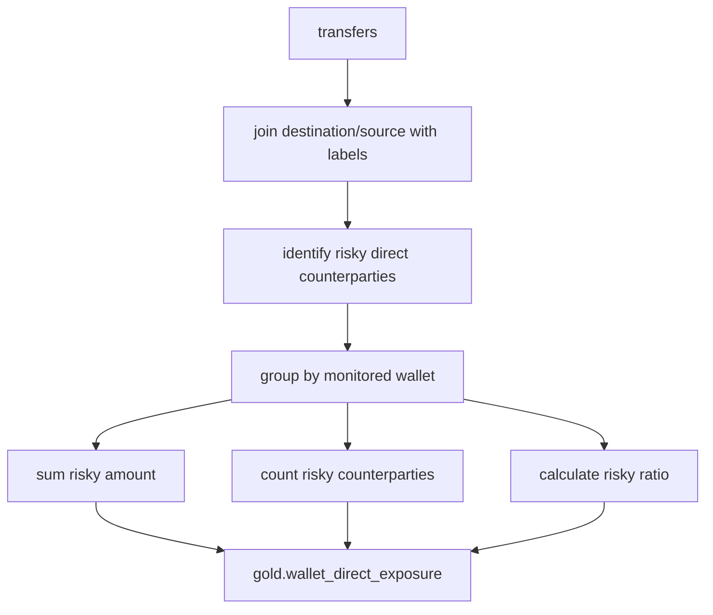

Result:

```text
wallet | direct_illicit_in_ratio | direct_illicit_out_ratio | risky_counterparties
-------+-------------------------+--------------------------+-------------------
A      | 0.18                    | 0.02                     | 3
B      | 0.00                    | 0.00                     | 0
```

---

## <mark>21. Example: two-hop exposure with joins</mark>

Suppose:

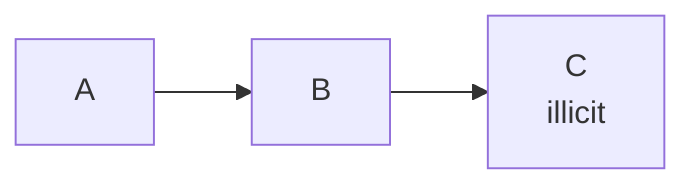

<mark>A simple topological two-hop calculation can self-join the edge table. Conceptually:</mark>

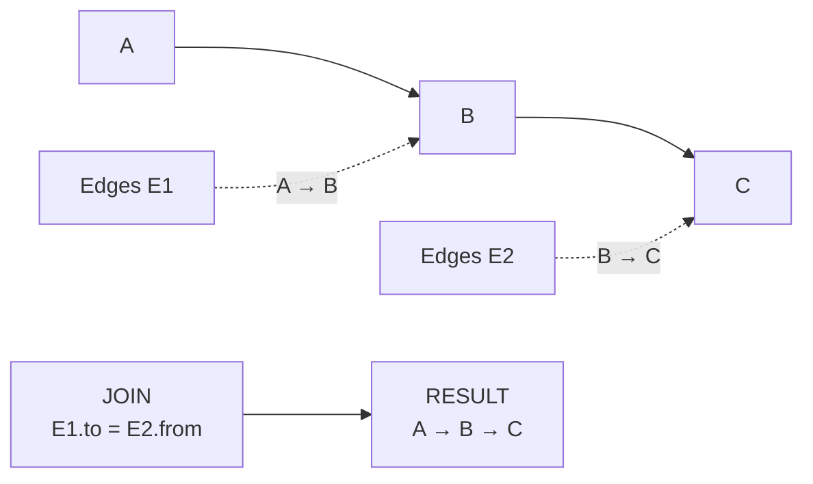

Then join `C` against the label table.


This is a scalable relational way to derive fixed-hop neighborhoods without loading the entire graph into one process.

However:

---

## <mark>22. Graph traversal vs Spark joins</mark>

For a small investigation:

```text
in-memory graph traversal
BFS / DFS
```

is easy.

For millions/billions of records:

```text
Spark joins
precomputed features
graph-processing systems
specialized tracing engines
```

may be more appropriate.

### Offline

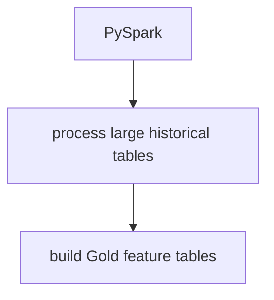

### Online / Go

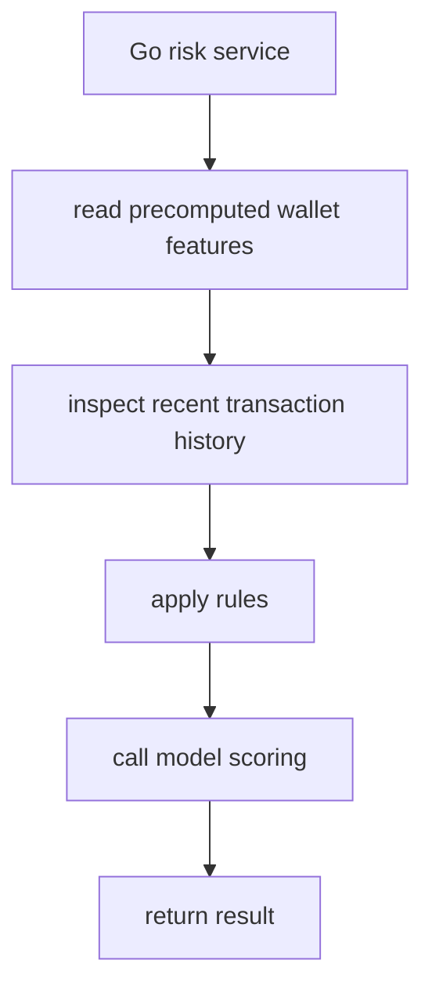

**<mark>The Go API should not run a 3-billion-edge BFS from scratch for every request. Heavy historical computation belongs in the data pipeline.</mark>**

Which is why the lambda architecture jumps in: (this is probably the most important architecture)

## <mark>23 . Lambda Architecture, Staleness & Cold Start</mark>

### <mark>1. The Lambda Architecture Pattern</mark>

The KYT pipeline (blockchain event → normalize → fast/stream path + heavy/batch path → combined scoring) is an application of the **Lambda architecture**, a pattern used broadly in fraud detection, AML, and real-time risk systems (e.g. Uber's Michelangelo, Feast/Tecton-style feature stores).

The core idea: split feature computation into two layers that update at different speeds, then merge them at scoring time.

#### <mark>Speed layer (stream path)</mark>

- Triggered by: a new transaction/blockchain event (Trigger 1)
- Updates: cheap, lightweight features only — `tx_count_24h`, `volume_24h`, direct counterparty, direct sanctions match
- Latency: milliseconds to seconds
- Storage: online feature store (e.g. Redis)

#### <mark>Batch layer (heavy path)</mark>

- Triggered by: periodic schedule, intelligence updates, or risk engine changes (Triggers 4, 5, and part of 2)
- Updates: expensive graph features — N-hop exposure, `direct_illicit_ratio`, `two_hop_illicit_neighbors`, graph distance to illicit entities
- Latency: minutes to hours (Spark job processing full historical transfer tables)
- Storage: offline/Gold feature store

#### <mark>Serving layer (combination point)</mark>

- At scoring time, the risk engine (Go scorer) loads:
  - **Latest fast features** (from the online store — always current)
  - **Most recent heavy features** (from the Gold store — as fresh as the last batch run, not necessarily current)
  - **Current transaction context** and **intelligence/attribution data** <mark>as input</mark>
- These are combined into one feature vector and passed to the rule engine + ML model.

<mark>**Why split it this way at all?** Graph computation (N-hop traversal across a large transfer graph) is too expensive to redo synchronously on every transaction.</mark> Splitting the work means the system can respond in real time (fast path) while still incorporating deep graph context (batch path) — accepting that the graph context is always *slightly behind* the present moment. This tradeoff is the entire point of Lambda architecture: real-time responsiveness in exchange for bounded, self-correcting staleness in the expensive layer.

That tradeoff is exactly where the two problems below come from.

### <mark>2. Problem A: Staleness (address already exists)</mark>

**Setup:** An address has been seen before and already has heavy features sitting in the Gold store from a previous Spark run.

<mark>**What happens:**</mark>

1. A new transaction arrives (e.g. Alice deposits 2,000 USDC at 10:00:00).
2. <mark>Stream path updates fast features immediately</mark> (10:00:01) — `tx_count_24h`, `volume_24h`, direct sanctions check, etc.
3. Heavy features (`direct_illicit_ratio`, `two_hop_illicit_neighbors`, etc.) are **not** recomputed — <mark>they're still whatever the last Spark run produced, which could be minutes or hours old.</mark>
4. <mark>The Go scorer runs anyway (10:00:02), combining fresh fast features with stale-but-existing heavy features, and produces a risk result.</mark>
5. Later (10:05+, or on the next scheduled/triggered run — Trigger 5), <mark>Spark recomputes the full graph. Heavy features update in the Gold store.</mark>
6. If the newly computed heavy features would have changed the risk verdict materially, the system doesn't just silently overwrite the old score — <mark>it compares old vs new output and, if the drift is significant, emits a **retrospective alert**.</mark>

**Key point:** this is a *deliberate, accepted tradeoff*, not a bug. The system knowingly scores with slightly outdated graph context in exchange for real-time response, and compensates with a self-correcting retrospective loop rather than trying to make everything synchronous.

**What triggers the correction:**

- Trigger 5 (periodic/scheduled monitoring) — routine recomputation on a schedule
- Trigger 4 (risk engine change) — rules/model/thresholds changed, batch rescore + compare old vs new
- Trigger 2 (intelligence update) — a sanctions/attribution list changes, affected accounts get targeted recomputation (not a full blind rescore)

### <mark>3. Problem B: Cold Start (address has never been seen before)</mark>

This is a **different problem in kind, not just degree**, and it's easy to conflate with staleness but shouldn't be.

**Setup:** A brand-new address transacts for the first time. It has never appeared in the historical transfer table, so Spark has never built a graph neighborhood for it.

**What happens:**

- <mark>Fast features can still be computed</mark> (this is its first transaction, so counters start fresh — still meaningful).
- <mark>Heavy features don't exist as *stale* values to fall back on — there's simply **nothing there**.</mark> `direct_illicit_ratio`, `two_hop_illicit_neighbors`, etc. are all null/missing, not outdated.
- <mark>If the risk engine isn't designed for this, missing values could get silently treated as "0 risk"</mark> (dangerous — a new address is exactly what a bad actor would use before it's been graphed) or the transaction could get blocked outright (unusable — most new addresses are legitimate).

<mark>**Why "wait for the next batch run" (Problem A's fix) doesn't solve this:** there's no old value to fall back on while waiting. The system needs an explicit default/fallback policy, not just a self-correcting loop.</mark>

<mark>**How production systems typically handle it:**</mark>

- **Treat missing heavy features as "unknown," not "safe."** Don't default nulls to 0. Either exclude those rules from scoring or apply a deliberately cautious default, and mark the result as based on incomplete graph history.
- **Weight fast + rule-based signals more heavily** for new addresses — direct sanctions match, transaction size, velocity, direct counterparty reputation are all knowable instantly even with zero graph history.
- **Flag "new address / incomplete profile" as its own risk signal.** A brand-new address moving a large amount is itself mildly suspicious, independent of any graph feature.
- **Expedite batch inclusion.** Push new addresses preferentially into the next Spark run, or run a lightweight on-demand 1-hop lookup, to shrink the cold-start window rather than waiting for the full periodic cycle.
- **Soft-hold high-risk-looking new addresses.** If fast signals + rules already look concerning on a new address, route to review/hold rather than auto-allow, since heavy features aren't available yet to rule it out.

### 4. Summary Comparison

|                    | Staleness (Problem A)                                        | Cold Start (Problem B)                                       |
| ------------------ | ------------------------------------------------------------ | ------------------------------------------------------------ |
| Address history    | Previously seen                                              | Never seen before                                            |
| Heavy features     | Exist, but outdated                                          | Don't exist at all                                           |
| Root cause         | Batch layer lags behind stream layer (Lambda tradeoff)       | No graph data has ever been built for this entity            |
| Risk if mishandled | Scoring on outdated context (usually acceptable, self-corrects) | Silently defaulting to "safe" (dangerous) or blocking all new addresses (unusable) |
| Fix mechanism      | Self-correcting: periodic/triggered batch rescore + drift comparison + retrospective alerts | Explicit fallback policy: null-aware scoring, heavier reliance on fast/rule signals, expedited batch inclusion, soft-hold logic |
| Relevant triggers  | Trigger 5 (scheduled), Trigger 4 (engine change), Trigger 2 (intelligence update) | Not solved by any trigger alone — needs design-time handling in the rule engine/aggregator |

**Bottom line:** Lambda architecture's fast/batch split is what makes real-time KYT scoring possible at all, but it inherently produces two failure modes that need different treatment — staleness is a timing problem solved by rescoring and drift detection, while cold start is a missing-data problem solved by explicit fallback design. A mature KYT system treats these as two separate engineering requirements, not one.

<mark>the full architecture:</mark> <mark>(this diagram contains the exact production architecture flow, read carefully)</mark>


## 24. Checkpoint concept

A streaming process needs to recover after restart. Checkpointing stores progress/state information needed for recovery.

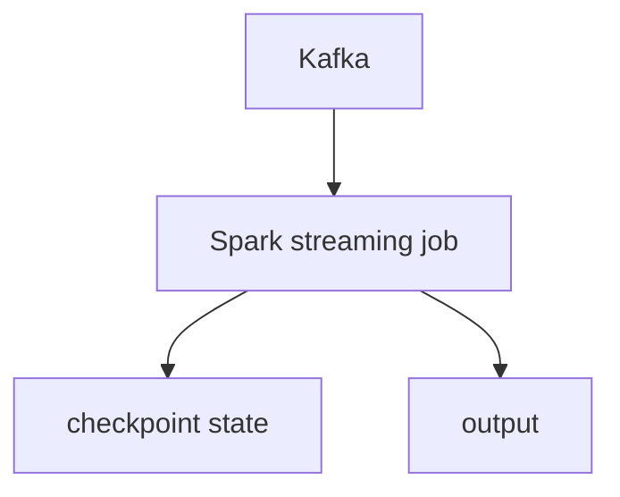

If the worker restarts, the checkpoint helps the query recover from its known progress/state rather than behaving like a completely new job.

> **This is conceptually related to Kafka offsets, but Spark's streaming checkpoint contains query-specific progress and state as well.**

## 25. Why store Parquet instead of giant CSV files?

For analytical data, columnar formats such as Parquet are generally more suitable than massive CSV files because they preserve schema/types and allow analytics engines to read relevant columns efficiently.

Conceptually:

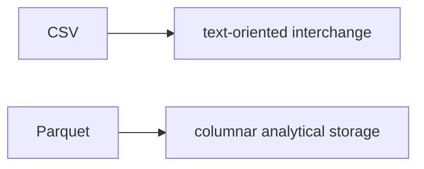

## 26. Offline vs online features

This distinction is professional and important.

### Offline features

Computed from large historical datasets.  (the featurs spark handles and take time)

```text
lifetime volume
historical risky exposure
90-day counterparty diversity
long-term graph relationships
```

### Online features

Need to reflect very recent activity. (the features stream handles quickly)

```text
tx_count_last_10m
volume_last_hour
new risky counterparty just seen
latest sanctions match
```

At scoring time:

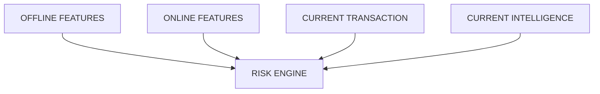

## <mark>27. Avoid feature leakage</mark>

Suppose you train a model to classify a transaction that occurred at time T.

You accidentally use a feature computed using transactions that happened after T.

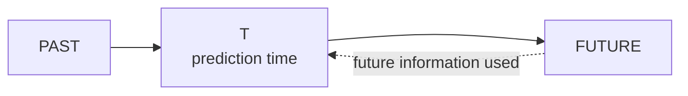

The model has seen information that would not have existed at prediction time. This is <mark>data leakage</mark> / temporal leakage. Your offline feature computation must respect time when building training examples.

**At prediction time, features must be derived only from information that would have been available at that time.**

## 28. Reorg awareness

Blockchains can reorganize recent chain history. A transaction that appeared in one canonical chain view may later be replaced before sufficient finality. For a production observer:

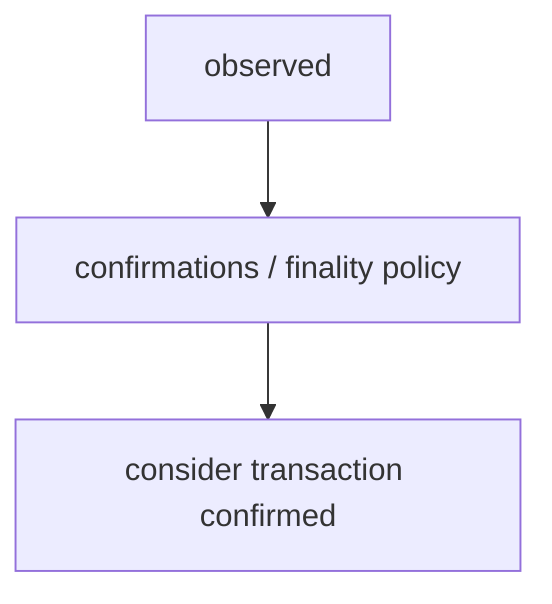

## 29. How this integrates with the Go backend

The eventual Go service should not become the entire data platform. Correct separation:

```text
PYSPARK / DATA PIPELINE
- historical ingestion
- normalization at scale
- large joins
- feature aggregation
- Gold tables

PYTHON / ML
- training
- evaluation
- model artifact

GO (the stream event section)
- consume transaction event
- retrieve current features
- sanctions / intelligence lookup
- run deterministic rules
- obtain ML probability
- aggregate risk
- produce explainable result
- persist / publish result
```

This is the architecture we are working toward.

## 35. What happens in a real integration?

A real integration may already have:

```text
blockchain observers
normalized transaction models
Kafka events
provider APIs
Chainalysis / TRM / another KYT vendor
internal label databases
existing data lake
existing Spark pipelines
existing PostgreSQL schemas
existing service interfaces
```

Your job becomes:

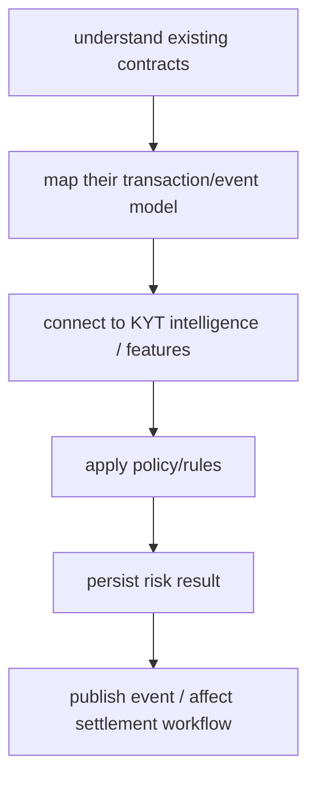

---

## 36. What we will actually implement later

The final project should eventually contain:

```text
data/
  sample graph / downloaded dataset instructions

spark/
  bronze_to_silver.py
  silver_to_gold.py

ml/
  train.py
  evaluate.py

backend/
  Go KYT API

intelligence/
  sanctions loader
  labels

rules/
  deterministic KYT rules

docs/
  architecture
  graph model
  data pipeline
  scoring
```

The important point for Days 2-3 is that you understand why each directory exists

## 37. references

**Chainalysis KYT:** https://www.chainalysis.com/product/kyt/

**Databricks - Medallion Architecture:** https://docs.databricks.com/gcp/en/lakehouse/medallion

**Apache Spark - DataFrames:** https://spark.apache.org/docs/latest/sql-programming-guide

**Apache Spark - Structured Streaming:** https://spark.apache.org/docs/latest/streaming/
