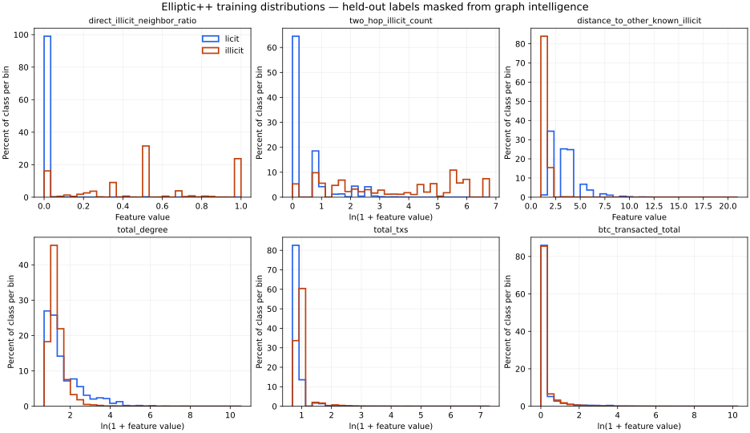

# Training-only rule threshold analysis

This is offline analyst research, not a Go rule implementation or ML training.
Candidates describe coarse graph-neighbor intelligence; none proves criminal activity.

## Data and split

The canonical table has 265,354 labeled targets. 557,588 unknown targets were excluded, not converted to licit.
One wallet per row; a deterministic 80/20 class-stratified wallet split uses NumPy seed `20260928`.

| Partition | Wallets | Licit | Illicit | Illicit prevalence |
| --- | ---: | ---: | ---: | ---: |
| train | 212,283 | 200,870 | 11,413 | 5.38% |
| validation | 53,071 | 50,218 | 2,853 | 5.38% |

## Leakage controls and remaining limitations

The original canonical graph features use all public labels. Simply splitting those rows would expose validation labels through neighbors. Here all neighbor-label features are rebuilt using only training-wallet labels. Validation labels and all other nontraining labels are masked to unknown BEFORE any graph-intelligence calculation. The canonical CSV is never modified.

Unknown wallets remain unlabeled topology/bridge nodes, but never enter class distributions, threshold selection, or performance denominators. Directed degrees are preserved; intelligence traverses the deduplicated undirected graph. Target self-label exclusion is retained and independently audited on 16 graph nodes, with synthetic invariance tests.

This masks validation labels from an intelligence source containing 11,413 illicit training nodes. Training and validation use the same intelligence inventory; no held-out label is revealed to tune or recompute it.

This remains a STATIC, TRANSDUCTIVE, wallet-level experiment. Full topology, lifetime wallet aggregates, and latest observations are available across the graph. Wallets can belong to correlated entities or components across the split. Labels have no publication timestamps. The random split is not entity-disjoint, chronological, or a real-time deployment test; unusually strong graph results may reflect dense illicit clusters. A later untouched entity/time-aware test is needed before deployment. Validation is now a reported development holdout, not a reusable final test.

## Threshold selection protocol

All class-distribution comparisons, AUC rankings, candidate grids, template choices, and thresholds use TRAINING rows only. Rounded grids use powers of ten and 1/2/5 multipliers plus small integer/ratio grids; no arbitrary exact-value cutoffs or exhaustive cross-feature search are used. All 74 features are inspected, but absolute timesteps/block identifiers are excluded from rule conditions because they can encode dataset-era artifacts.

Every selected candidate requires at least 100 triggered training rows, 50 true positives, and training FPR <= 1.00%. R1-R3 maximize F0.5 subject to precision >= 80%. R4/R6-R8 maximize recall subject to precision >= 95%; R5 uses >= 99.9%. Ties prefer precision, then fewer false positives. These analyst operating targets are experimental, not business-approved tolerances.

F0.5 weights precision more than recall. Quantile probes construct the grids from training values; the template library is small and listed in the script. A threshold is a measured candidate, not a universally correct KYT boundary.

Selected conditions and training metrics were saved to `analysis/results/frozen_rules.json` BEFORE validation metrics were calculated. Its SHA-256 is `a783fbc6a778f936e59fb3cee5258a43b83d3a264f2286a13592f6f9776c2450`. The validation phase reads that artifact and cannot select new thresholds. Precision/recall/FPR are reported for every frozen rule, without selecting winners after inspecting validation.

## Training class distributions

The table below gives class medians and 90th percentiles. `feature_distributions.csv` additionally contains means, zero rates, missing counts, extrema, and q05/q25/q50/q75/q90/q95/q99 for every feature and class. Mean alone is misleading for these skewed wallet distributions.

| Feature / source name | Licit median | Illicit median | Licit p90 | Illicit p90 | Direction-free AUC separation |
| --- | ---: | ---: | ---: | ---: | ---: |
| `direct_illicit_neighbor_ratio` (direct_illicit_neighbor_ratio) | 0 | 0.5 | 0 | 1 | 0.917 |
| `one_hop_illicit_count` (one_hop_illicit_count) | 0 | 1 | 0 | 2 | 0.914 |
| `two_hop_illicit_count` (two_hop_illicit_count) | 0 | 36 | 7 | 404 | 0.909 |
| `distance_to_other_known_illicit` (distance_to_other_known_illicit) | 3 | 1 | 5 | 2 | 0.962 |
| `in_degree` (in_degree) | 1 | 1 | 10 | 4 | 0.529 |
| `out_degree` (out_degree) | 0 | 1 | 4 | 2 | 0.595 |
| `total_degree` (total_degree) | 2 | 2 | 18 | 5 | 0.556 |
| `unique_neighbors` (unique_neighbors) | 2 | 2 | 18 | 5 | 0.545 |
| `elliptic_f_001` (num_txs_as_sender) | 0 | 1 | 1 | 1 | 0.708 |
| `elliptic_f_002` (num_txs_as receiver) | 1 | 1 | 1 | 1 | 0.544 |
| `elliptic_f_006` (total_txs) | 1 | 2 | 2 | 2 | 0.737 |
| `elliptic_f_010` (btc_transacted_total) | 0.0108074 | 0.0204 | 0.75775 | 0.710912 | 0.610 |
| `elliptic_f_015` (btc_sent_total) | 0 | 0.0084 | 0.240823 | 0.330266 | 0.696 |
| `elliptic_f_020` (btc_received_total) | 0.000306035 | 0.0067 | 0.240603 | 0.31897 | 0.600 |
| `elliptic_f_025` (fees_total) | 0.00192127 | 0.00342748 | 0.0360456 | 0.0680639 | 0.574 |
| `elliptic_f_027` (fees_max) | 0.00189014 | 0.00281517 | 0.0340584 | 0.0657015 | 0.558 |
| `elliptic_f_030` (fees_as_share_total) | 1.61136e-05 | 0.0002 | 0.000537529 | 0.000932387 | 0.745 |
| `elliptic_f_036` (blocks_btwn_txs_min) | 0 | 1 | 2 | 5 | 0.715 |
| `elliptic_f_038` (blocks_btwn_txs_mean) | 0 | 1 | 2 | 5 | 0.721 |
| `elliptic_f_043` (blocks_btwn_input_txs_mean) | 0 | 0 | 0 | 0 | 0.502 |
| `elliptic_f_048` (blocks_btwn_output_txs_mean) | 0 | 0 | 0 | 0 | 0.513 |

AUC here is a training-only univariate ranking diagnostic with average-rank ties; we report max(AUC, 1-AUC) to allow either direction. It is not validation model performance. Nullable distances are excluded from that feature's numeric summaries/AUC and reported separately, never filled with zero. 0.5 indicates little rank separation; a high AUC alone does not establish a useful low-FPR cutoff.

## Useful and weak signals

- Direct illicit-neighbor ratio and exact two-hop illicit count provide the strongest useful single-feature cutoffs. They rely on the simulated attribution inventory, not behavioral proof.
- One-hop count and distance <= 1 have IDENTICAL trigger sets. `one_hop_illicit_count` also equals `direct_illicit_neighbor_count`. Do not implement all three as independent findings. Distance <= 2 expands into many licit neighborhoods and is much weaker.
- More attributed neighbors are not assumed to be monotonically more predictive: training precision for one-hop count >=1/2/3/5 is 79.94%/81.53%/65.38%/47.98%. Large hubs can have many illicit connections without being illicit themselves. Distance <=2 has training precision 13.68% and FPR 35.62%; its high AUC does not justify that broad proximity rule.
- Raw degree, unique-neighbor counts, BTC totals, and transaction counts have substantial class overlap. High activity or high value alone is not a defensible illicit rule. Absolute date/block identifiers can be dataset artifacts and are excluded.
- Fees can isolate a small enriched subset, but an enriched minority is not a general KYT detector. Intervals are in blocks, not hours; zero intervals often accompany limited activity and do not prove rapid forwarding.
- The complete training cutoff results below make weak-feature assessments quantitative. Behavior-guarded graph candidates are evaluated to see whether they add value beyond attribution, without interpreting total BTC sent as illicit exposure.

| Feature | Best training F0.5 cutoff (support >=100, TP >=50) | Precision | Recall | FPR | Triggered |
| --- | --- | ---: | ---: | ---: | ---: |
| `direct_illicit_neighbor_ratio` | `>= 0.2` | 89.18% | 79.38% | 0.5471% | 10,159 |
| `one_hop_illicit_count` | `>= 1` | 79.94% | 83.91% | 1.1963% | 11,980 |
| `two_hop_illicit_count` | `>= 50` | 99.53% | 47.97% | 0.0129% | 5,501 |
| `distance_to_other_known_illicit` | `<= 1` | 79.94% | 83.91% | 1.1963% | 11,980 |
| `in_degree` | `<= 3` | 6.36% | 86.48% | 72.3572% | 155,214 |
| `out_degree` | `>= 1` | 10.00% | 87.76% | 44.8818% | 100,170 |
| `total_degree` | `<= 3` | 6.87% | 78.95% | 60.8294% | 131,198 |
| `unique_neighbors` | `<= 3` | 6.76% | 79.06% | 61.9928% | 133,548 |
| `num_txs_as_sender` | `>= 1` | 10.00% | 87.76% | 44.8703% | 100,147 |
| `num_txs_as receiver` | `>= 1` | 6.02% | 75.10% | 66.5888% | 142,328 |
| `total_txs` | `>= 2` | 17.78% | 66.32% | 17.4262% | 42,573 |
| `btc_transacted_total` | `>= 0.001` | 7.24% | 99.20% | 72.2686% | 156,488 |
| `btc_sent_total` | `>= 0.001` | 10.96% | 86.13% | 39.7755% | 89,727 |
| `btc_received_total` | `>= 0.001` | 8.91% | 73.35% | 42.6022% | 93,947 |
| `fees_total` | `>= 0.2` | 51.32% | 3.58% | 0.1932% | 797 |
| `fees_max` | `>= 0.2` | 67.28% | 3.55% | 0.0981% | 602 |
| `fees_as_share_total` | `>= 0.0002` | 11.72% | 51.27% | 21.9366% | 49,916 |
| `blocks_btwn_txs_min` | `>= 1` | 18.97% | 60.33% | 14.6393% | 36,292 |
| `blocks_btwn_txs_mean` | `>= 0.01` | 18.61% | 64.24% | 15.9660% | 39,403 |
| `blocks_btwn_input_txs_mean` | `<= 10` | 5.42% | 99.66% | 98.7997% | 209,833 |
| `blocks_btwn_output_txs_mean` | `<= 5` | 5.58% | 98.80% | 95.0351% | 202,173 |

## Frozen candidate rules

| ID | Exact condition (AND where shown) | Train precision | Train recall | Train FPR | Train triggers |
| --- | --- | ---: | ---: | ---: | ---: |
| R1 | `direct_illicit_neighbor_ratio >= 0.2` | 89.18% | 79.38% | 0.5471% | 10,159 |
| R2 | `two_hop_illicit_count >= 50` | 99.53% | 47.97% | 0.0129% | 5,501 |
| R3 | `one_hop_illicit_count >= 2` | 81.53% | 23.32% | 0.3002% | 3,265 |
| R4 | `direct_illicit_neighbor_ratio >= 0.6` | 97.28% | 31.08% | 0.0493% | 3,646 |
| R5 | `two_hop_illicit_count >= 100` | 99.94% | 40.59% | 0.0015% | 4,636 |
| R6 | `direct_illicit_neighbor_ratio >= 0.1 AND two_hop_illicit_count >= 2` | 95.95% | 69.37% | 0.1663% | 8,251 |
| R7 | `direct_illicit_neighbor_ratio >= 0.1 AND total_txs >= 2` | 95.96% | 56.82% | 0.1359% | 6,758 |
| R8 | `direct_illicit_neighbor_ratio >= 0.4 AND btc_sent_total >= 0.001` | 95.12% | 53.99% | 0.1573% | 6,478 |

For preserved fields, the exact CSV aliases are in each machine-readable condition and the source mapping in `data/derived/feature_schema.json`.

## Held-out validation (thresholds unchanged)

Positive means illicit. Precision = TP/(TP+FP), recall = TP/(TP+FN), FPR = FP/(FP+TN). Support is triggered validation rows, with TP/FP shown separately. Denominators exclude unknown targets. Percentages reflect this dataset's 5.38% illicit prevalence and will change with production prevalence.

| ID | Precision | Recall | FPR | Triggered | TP | FP | Approximate precision 95% Wilson interval |
| --- | ---: | ---: | ---: | ---: | ---: | ---: | --- |
| R1 | 88.38% | 79.21% | 0.5914% | 2,557 | 2,260 | 297 | 87.08% to 89.57% |
| R2 | 99.72% | 49.46% | 0.0080% | 1,415 | 1,411 | 4 | 99.28% to 99.89% |
| R3 | 78.65% | 21.70% | 0.3345% | 787 | 619 | 168 | 75.65% to 81.37% |
| R4 | 97.56% | 29.37% | 0.0418% | 859 | 838 | 21 | 96.29% to 98.40% |
| R5 | 99.91% | 41.18% | 0.0020% | 1,176 | 1,175 | 1 | 99.52% to 99.98% |
| R6 | 95.52% | 70.21% | 0.1872% | 2,097 | 2,003 | 94 | 94.55% to 96.32% |
| R7 | 95.92% | 58.50% | 0.1414% | 1,740 | 1,669 | 71 | 94.88% to 96.75% |
| R8 | 94.71% | 53.31% | 0.1693% | 1,606 | 1,521 | 85 | 93.50% to 95.70% |

Intervals are descriptive binomial intervals, not guarantees: graph-linked wallets are correlated, and selection searched many training thresholds. Rounding to 100% precision does not mean zero future false positives.

## Why these candidates and how to review them

- **R1 — Direct illicit-neighbor concentration:** Concentration captures a high share of attributed illicit counterparties; broad screening candidate.
- **R2 — Broad second-hop illicit neighborhood:** Captures many distinct illicit nodes at exact distance two, including wallets with weaker direct exposure.
- **R3 — Multiple direct illicit neighbors:** Simple counterpart-count alternative. Larger counts are not assumed to be monotonically riskier.
- **R4 — Strict direct-neighbor concentration:** Alternative operating point targeting at least 95% training precision; trades coverage for confidence.
- **R5 — Strict second-hop illicit neighborhood:** Alternative operating point targeting at least 99.9% training precision, rather than a separate additive finding.
- **R6 — Direct concentration with second-hop corroboration:** Requires evidence in both direct and exact two-hop neighborhoods; may suppress incidental direct connections.
- **R7 — Direct concentration with repeated transaction activity:** Tests whether multiple provided transactions improve a graph-based condition. Activity alone is not illicit evidence.
- **R8 — Direct concentration with BTC sent:** Tests a wallet-level BTC-sent guard on graph concentration. This is not an illicit-funds amount or monetary-exposure ratio.

R1 and R2 are the simplest complementary core candidates, chosen from training results before validation. The remaining rules are alternatives or refinements. R4 is nested within R1; R5 is nested within R2. Many compound rules overlap heavily. Do not sum their recalls or multiply confidence as though independent.

For the fixed R1 OR R2 core pair, validation precision is 89.88%, recall 93.38%, FPR 0.5974%, with 2,964 triggers (2,664 TP and 300 FP). This reports overlap-aware coverage, not a scoring formula. Pairwise overlap counts are in the JSON report.

Validation point estimates below their TRAINING selection floors: R3 (78.65%, floor 80.00%), R8 (94.71%, floor 95.00%). We retain all frozen candidates and report them instead of retuning thresholds on validation. Count-only alternatives and BTC guards need review before adoption. The labeled population is selective, so unknown-wallet performance and production false-positive burden remain unmeasured.

A behavior condition that adds little validation benefit should not be added to the eventual engine merely to increase rule count. These eight candidates meet training selection constraints; they are not eight independent risk factors or approved production controls. Six stronger candidates (R1, R2, R4, R5, R6, R7) are now implemented as Go rules; R3 and R8 remain under review. No numeric weight, risk score, or block decision is implemented.

## Reproduce and artifacts

```sh
python -m analysis.rule_feature_analysis --phase all
python -m unittest discover -s tests -v
```

The existing pandas/NumPy feature requirements suffice. Optional `--plot` additionally needs matplotlib and writes training-only distribution plots. The `inspect-train`, `select`, and `evaluate` phases expose the frozen sequence for review; select/evaluate reuse the ignored scratch table only after verifying input hashes and split membership. Evaluation additionally checks the frozen cache hash and training metrics.

- `analysis/results/training_inspection.json`: split configuration, source hashes, all training feature rankings, label masking and self-exclusion audit.
- `analysis/results/feature_distributions.csv`: both training class distributions for all 74 features.
- `analysis/results/threshold_candidates.csv`: all one-condition training threshold results, including weak features.
- `analysis/results/template_search.json`: the declared conjunction/operating-point searches and their training metrics.
- `analysis/results/frozen_rules.json`: selected conditions and training metrics, created before validation.
- `analysis/results/rule_analysis_report.json`: frozen rules, held-out metrics, overlap counts and fixed core-pair coverage.
- `analysis/.cache/supervised_features.csv`: ignored, recomputable analysis table; canonical input stays untouched.

The [Go rule catalog](../internal/rules/candidates.go) implements the six selected threshold conditions and returns findings only. Rule semantics and operating tolerances still need review before production use; no ML fit, scoring formula, or API is included.


